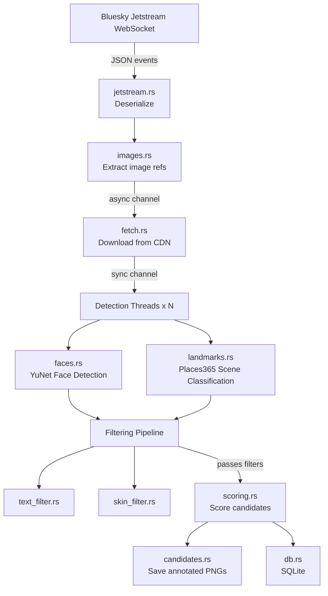

```mermaid
graph TD
    WS[Bluesky Jetstream WebSocket] -->|JSON events| JET[jetstream.rs<br/>Deserialize]
    JET --> IMG[images.rs<br/>Extract image refs]
    IMG -->|async channel| FETCH[fetch.rs<br/>Download from CDN]
    FETCH -->|sync channel| DET[Detection Threads x N]

    DET --> FACES[faces.rs<br/>YuNet Face Detection]
    DET --> LAND[landmarks.rs<br/>Places365 Scene Classification]

    FACES --> FILT[Filtering Pipeline]
    LAND --> FILT
    FILT --> TF[text_filter.rs]
    FILT --> SF[skin_filter.rs]

    FILT -->|passes filters| SCORE[scoring.rs<br/>Score candidates]
    SCORE --> SAVE[candidates.rs<br/>Save annotated PNGs]
    SCORE --> DB[db.rs<br/>SQLite]
```
