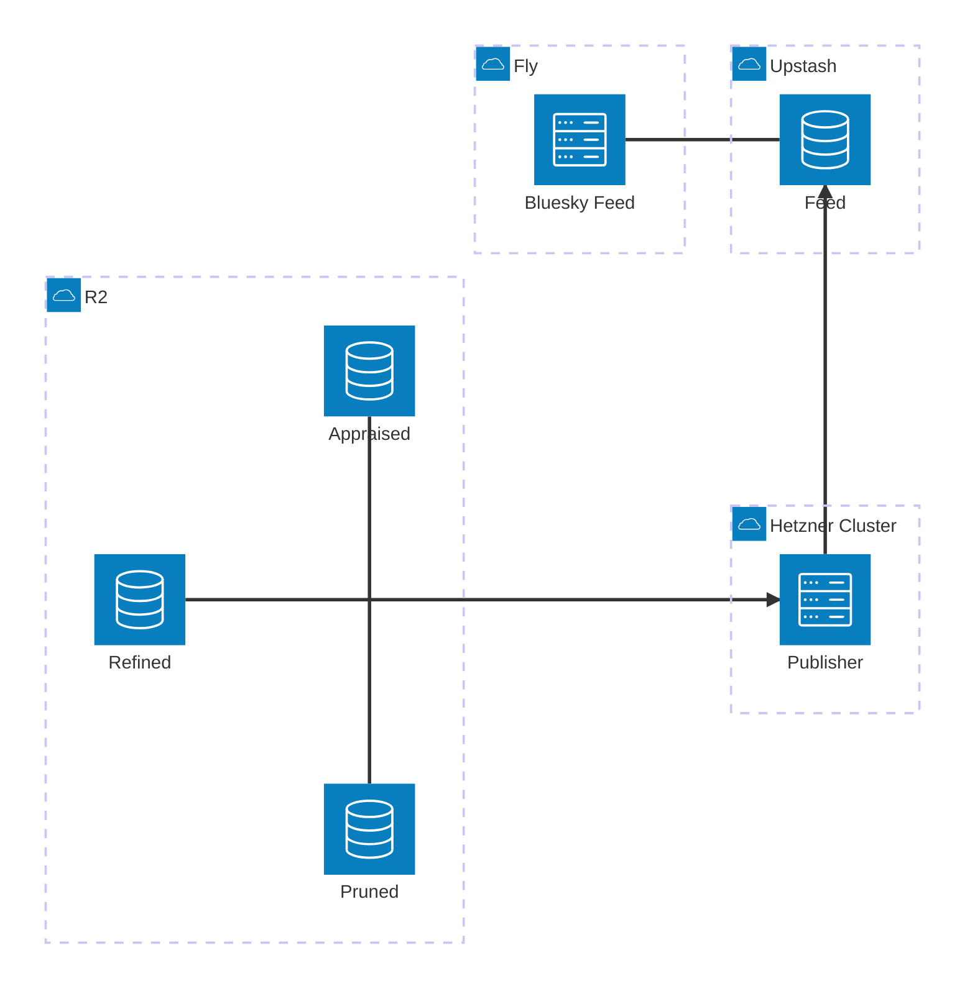

# Current Slice: Split out `skeet-feed`/`skeet-appraise`/`skeet-publish`

### Target

I want to get to the following different division of responsibilities:
* `skeet-feed`:
    * lives at `bobby-staging.houseofmoran.io`
    * handles:
        * bluesky feed
        * public website listing skeets ordered by recency and filtered by band >= MedHigh; this is a much simpler page than today's homepage (the current rich homepage moves to `skeet-appraise`)
    * bias is towards simplicity, reliability and speed (latency/cachability)
* `skeet-appraise`:
    * lives at `bobby-appraisals-staging` (the eventual MagicDNS FQDN `bobby-appraisals-staging.<tailnet>.ts.net`) within the hetzner cluster, accessible via tailscale
    * handles:
        * showing current status and editable controls (appraisals) for:
            * what is currently live as the feed (this is effectively the current `skeet-feed` homepage, moved here)
            * what has been found by the pruner and refiner for each skeet and associated images
        * manual appraisals (assigning High/MedHigh/MedLow/Low)
    * bias is towards ease-of-use and quick interactive updates
* `skeet-publish`:
    * runs in hetnzer k8s cluster like `live-refine` looking for changes to dependent tables
    * handles:
        * watching for changes in what skeets / images have been found and scored by a model as well as what has been appraised
        * determining what needs to be published as the feed; this is the canonical single place we decide this
        * this is where we apply the "ordered by recency and filtered by band >= MedHigh" from above i.e. the `skeet-feed` just blindly accepts the ordering specified by the publisher
        * resolving the public image URL for each published image — this is the **Bluesky CDN** URL (`https://cdn.bsky.app/img/feed_thumbnail/plain/{did}/{cid}@jpeg`), *not* our own annotated-image endpoint. The redis Feed stores `image-url:skeet-id` pairs, but whether the URL is read whole from the store, templated from a persisted blob `cid`, or derived some other way is hidden behind a trait — readers never know (see Phase 3 group A).
* `skeet-refine` stays as-is; `skeet-prune` needs one small addition — it builds the CDN URL today (`firehose.rs`) but **drops the `cid` at the classify stage**. Rather than add a store field, we carry the `cid` inside the image id itself via a new `ImageId::V3(BlueskyCid)` variant — no store-schema change, and existing code keeps treating `ImageId` opaquely. This is a prerequisite for Phase 5 rendering real images (see Phase 3 group A0).

The parts are related as follows by introducing a new redis table in upstash that sits between publisher and feed. The publisher writes `image-url:skeet-id` pairs to this table (it resolves the image URL behind a trait). The Bluesky feed reads the pairs and extracts a unique, ordered list of skeet-ids; the image URLs (Bluesky CDN, so images are served by Bluesky and never by us — which helps `skeet-feed` suspend) are used from Phase 5 onwards to render the public image grid:

### Bugs / Refactors

#### Scope each Dockerfile to its crate with `-p`

##### Core, ahead of other work

* [x] audit each Dockerfile and map it to the single crate it ships, then scope both the chef cook and the final build to that crate:
    1. `Dockerfile.skeet-feed` → `-p skeet-feed` (bin `skeet-feed`)
    2. `Dockerfile.pruner` → `-p skeet-prune` (bin `pruner`)
    3. `Dockerfile.live-refine` → `-p skeet-refine` (bin `live-refine`)
    4. (no `Dockerfile.compact`/`Dockerfile.bench-firehose` exist; the other Dockerfiles are:)
        - `Dockerfile.optimise` → `-p skeet-store` (bin `optimise`)
        - `Dockerfile.cloudflare-exporter` → `-p cloudflare-exporter` (bins `sync_operations`, `sync_storage`)
        - `Dockerfile.openai-exporter` → `-p openai-exporter` (bin `sync_costs`)
* [x] in the builder stage, replace the workspace-wide cook with a scoped cook so only the crate's dependency subtree compiles:
    * `cargo chef cook --release -p <crate> --recipe-path recipe.json`
    * leave `cargo chef prepare` running over the whole workspace — the recipe is deps-only and can stay shared
* [x] replace the final `cargo build` with `cargo build --release -p <crate> --bin <bin>` so each image stops compiling sibling binaries. Kept `--bin` because several crates have many binaries (`skeet-prune` has 6, `skeet-refine` has 5); a bare `-p <crate>` would compile all of them.
* [x] **TLS / `deadpool-redis`:** the note originally said "`live-refine` / `skeet-refine`", but `skeet-refine` has no redis/`cot` dependency at all. The crate that uses `cot` + `deadpool-redis` + TLS-to-Upstash is **`skeet-feed`**, and it declares both directly, so the scoped `-p skeet-feed` cook keeps them in the same dependency subtree and the feature-unification HACK still applies. No `Cargo.toml` change was needed. *(Still needs Docker-build verification that TLS to Upstash works in the built `skeet-feed` image.)*

##### Discover / improve as we do this slice

* [ ] verify caching actually improves: with deps unchanged, touch only `<crate>/src/main.rs`, rebuild, and confirm the cook/deps layer is reused (no dependency recompile). This is the direct test of whether `-p` + chef fixes the "recompiles everything" symptom for source-only changes.
* [ ] (optional) now that each image cooks its own copy of the shared deps (`tokio`, `reqwest`, `image`, tracing/otel, `shared`), decide whether to dedup across images: BuildKit cache mounts on `target/` + the cargo registry, or `--cache-from` the previous git-hash-tagged image (ties into Q2 above on git-hash layer caching)
* [ ] apply this same `-p` pattern when adding the `skeet-appraise` and `skeet-publish` Dockerfiles (Phases 1 and 3) rather than cloning a workspace-wide build

#### Make use of git-hash?

* [ ] now that docker images are built and named based on git-hash, can we exploit that for a more exact caching of layers?

#### Deny `expect()` as well

`expect()` is probably as bad an idea in main code as `unwrap()` so deny that as well, and instead prefer explicit Result+Err, unless in tests.

* [ ] similar to `unwrap_used = "deny"` and `allow-unwrap-in-tests = true` do the same for expect, and fix all related issues
* [ ] add a note about this to @rust.md like we do for `unwrap`

### Phases

We'll do this in phases, with a working system at each step

#### Phase 1: Split out `skeet-publish` as a library

This is not introducing a new service, but instead is factoring out the code already in `skeet-feed` which is to do with caching and generating a feed to instead live in a `skeet-publish` crate. This should live behind a trait which abstracts away as much detail as possible. The `skeet-feed` should depend only on this trait.

The trait surface should be **narrow** — `skeet-feed`'s `getFeedSkeleton` only needs an ordered, unique, visibility-filtered list of skeet-ids plus a `refreshed_at` for the `last-modified` header (image-urls get added to the surface in Phase 3/5, not now). The richer `CachedFeed` (entries + scores + appraisal maps) also moves into `skeet-publish` because the appraise homepage will consume it in Phase 2 — but it is *not* part of the `skeet-feed`-facing trait.

Transitional note: until Phase 2 moves `home`/`annotated_image` out, those handlers stay in `skeet-feed` and keep using the relocated `CachedFeed` directly. "`skeet-feed` depends only on the trait" is fully realised at the end of Phase 2; in Phase 1 it holds for the feed-generation path (`getFeedSkeleton`).

This is a pure refactor: no new service, no infra, no behaviour change. The existing `feed_endpoints` / `feed_integration` tests are the safety net — `getFeedSkeleton` output, `last-modified`, and `cache-control: no-cache` handling must stay byte-identical.

Tasks:

* [ ] **Create the `skeet-publish` crate** (lib only): add to workspace `members` and a `skeet-publish = { path = "skeet-publish" }` entry in `[workspace.dependencies]`; `[lints] workspace = true`. Deps: `skeet-store`, `shared`, `chrono`, `tokio`, `tracing` (add `image` only if a moved type needs it).
* [ ] **Move feed-generation policy** out of `skeet-feed` into `skeet-publish`, with its unit tests:
    * `effective_band.rs` (`image_effective_band`, `image_score_is_positive`) — this is the per-model visibility/scoring decision; per the rust rule, policy belongs in the crate that owns the decision (`skeet-publish`).
    * `visible_skeet_ids` / `visible_entries` (currently in `handlers.rs:26-68`).
* [ ] **Move the cache** `feed_cache.rs` (`FeedCache`, `CachedFeed`, `spawn_background_refresh`) into `skeet-publish`, with its tests. Keep the cot middleware `FeedCacheLayer`/`FeedCacheExtractor` in the web crate(s) for now — they wrap the relocated `FeedCache`; only the cache type + refresh logic move.
* [ ] **Define the trait + live impl** in `skeet-publish`:
    * `trait FeedSource` (async) → returns ordered, unique, visibility-filtered `Vec<SkeetId>` + `refreshed_at: Option<DateTime<Utc>>`, with a force-refresh path (to back `cache-control: no-cache`).
    * `LiveFeedSource` implementing it over `FeedCache` + `visible_entries`.
* [ ] **Rewire `skeet-feed`**:
    * `get_feed_skeleton` depends only on `Arc<dyn FeedSource>` (injected via a layer/extractor) instead of `FeedCacheExtractor`; apply `take(limit)` + last-modified exactly as today.
    * `did_document` / `describe_feed_generator` are unchanged (use `FeedConfig`).
    * `home` / `annotated_image` stay (transitional) using the relocated `CachedFeed`.
    * Add `skeet-publish` to `skeet-feed/Cargo.toml`; delete the now-moved local modules.
* [ ] **Wire the bin** `skeet_feed.rs`: construct `FeedCache` → wrap in `LiveFeedSource` → inject as `Arc<dyn FeedSource>`; keep `spawn_background_refresh`.
* [ ] **Verify**: `just clippy`; `just test-no-docker` (the existing feed tests must pass unchanged); confirm both `lib.rs` files stay < 300 lines.

#### Phase 2: Split out `skeet-appraise` as a standalone website

Even though we want to ultimately make this run within the hetzner cluster and be accessible over tailscale, initially we'll introduce a new fly.io website at `bobby-appraisals-staging.houseofmoran.io`. 

This can effectively copy/clone setup we already have for `bobby-staging.houseofmoran.io` as we are largely splitting out existing code.

After Phase 1 the shared feed/cache code lives in `skeet-publish`, so both web crates depend on it cleanly (no `skeet-appraise` → `skeet-feed` dependency). `skeet-appraise` consumes the richer `CachedFeed`; `skeet-feed` keeps only the narrow `FeedSource` trait.

Route split:
* **stays in `skeet-feed`** (the Bluesky feed): `/.well-known/did.json`, `app.bsky.feed.describeFeedGenerator`, `app.bsky.feed.getFeedSkeleton`.
* **moves to `skeet-appraise`** (the appraisal UI): `/` (rich home), `/skeet/{image_id}/annotated.png`, `/admin`, `/admin/appraise/{skeet,image}`, `/auth/{login,callback,logout}`.

Tasks:

* [ ] **Create the `skeet-appraise` crate** with bin `skeet-appraise` at `src/bin/skeet_appraise.rs`; add to workspace `members`. Mirror `skeet-feed/Cargo.toml` deps and add `skeet-publish`. It uses Redis sessions, so it **must declare `deadpool-redis` directly** (the cot + deadpool-redis TLS-to-Upstash feature-unification HACK — see `.claude/rules/docker.md` and root `Cargo.toml`).
* [ ] **Move the appraisal/admin/auth code** out of `skeet-feed` into `skeet-appraise`, with templates and tests:
    * `home` handler + `home.html` + `HomeEntry`, and `band_options`/`BandOption` (only the appraise UI needs them now).
    * `admin.rs` + `admin.html` / `admin_page.html` / `admin_row.html` + `appraise_skeet` / `appraise_image`.
    * `auth.rs` + `auth_config.rs` (`OAuthConfig` + layer/extractor).
    * `annotated_image` handler.
    * `appraiser_config.rs` (`AppraiserLayer`/`Extractor`), `started_at.rs`, `store_middleware.rs` (cot `Store` extractor), `static_assets.rs` (htmx) — none are needed by the feed endpoints once `home`/`annotated_image` leave.
    * `effective_band` is already in `skeet-publish` from Phase 1; `skeet-appraise` depends on it there.
* [ ] **Build the `AppraiseProject` + router** (`/`, `/skeet/{image_id}/annotated.png`, `/admin`, `/admin/appraise/{skeet,image}`, `/auth/{login,callback,logout}`). Middleware: StaticFiles, Session (redis/in-memory as today), `FeedCacheLayer`, `Store`, `Appraiser`, `OAuthConfig`, `StartedAt`. No `FeedConfig` (home doesn't use it).
* [ ] **Write the bin** `skeet_appraise.rs` by cloning `skeet_feed.rs` minus the bsky-identity args (`--hostname`, `--publisher-did`, `--feed-name`): keep `--store-path`, `--model-path`, `--max-entries`, `--max-age-hours`, `--bind`, `--local-admin`, and the OAuth/session/redis args. Construct `FeedCache` + `spawn_background_refresh`, inject via `FeedCacheLayer`.
* [ ] **Trim `skeet-feed`**:
    * Router keeps only the three feed endpoints; give `/` a minimal placeholder (small static page or redirect) so root isn't a 404 until Phase 5 replaces it with the image grid.
    * Drop now-unused deps (`oauth2`, `tower-sessions`, `deadpool-redis` + its TLS HACK, `image`, `urlencoding`) — let clippy/compiler confirm.
    * Simplify the `skeet-feed` bin Args (drop github/session/redis/admin/local-admin) and `fly.staging.toml` process args accordingly; drop the OAuth/session/redis secrets from `bobby-staging`.
* [ ] **Re-home the integration tests** following the code (tests exercise the public HTTP interface per the rust rules):
    * stays in `skeet-feed`: `did.json`, `describeFeedGenerator`, `getFeedSkeleton` coverage (`feed_integration.rs`, the feed half of `feed_endpoints.rs`).
    * moves to `skeet-appraise`: home/admin/appraise/auth + `redis_session.rs` + `common/mod.rs` session helpers. The cross-cutting "appraise-then-feed-visibility" cases in `feed_endpoints.rs` now span two services — seed appraisals via the store in setup and assert against `skeet-feed`'s `getFeedSkeleton`.
* [ ] **Build/deploy plumbing** (clone `skeet-feed`'s, per `.claude/rules/docker.md` "Adding a new service"):
    * `Dockerfile.skeet-appraise`: copy `Dockerfile.skeet-feed`, scope `-p skeet-appraise --bin skeet-appraise`, platform `linux/amd64`, copy `config/refine.toml`.
    * `just/container.just`: add `build-skeet-appraise` / `push-skeet-appraise`.
    * `fly.appraise-staging.toml`: clone `fly.staging.toml` → app `bobby-appraisals-staging`, skeet-appraise process args, `OTEL_SERVICE_NAME=skeet-appraise`, `RUST_LOG=skeet_appraise=info,skeet_store=info`, health check on `/`.
    * `just/appraise.just` (or extend `feed.just`): local run, `deploy_appraise_secrets` / `deploy_appraise_app`, `end_to_end_test_appraise`.
* [ ] **Secrets / OAuth / DNS / fly app**:
    * New (or updated) GitHub OAuth app with callback `https://bobby-appraisals-staging.houseofmoran.io/auth/callback`; store client id/secret in 1Password; create `bobby-appraisals-staging.env` (S3, SSE-C, OTEL, github oauth, session secret, admin users, redis url).
    * `fly apps create bobby-appraisals-staging`; add DNS + cert for the hostname; `fly secrets import`; deploy.
* [ ] **Verify**:
    * `skeet-appraise`: home renders, OAuth login works, admin paging + set/clear band works, `annotated.png` served.
    * `skeet-feed` unchanged: redeploy trimmed `bobby-staging`; `just end_to_end_test_staging` still green.
    * `just clippy`, `just test-no-docker`, `lib.rs` files < 300 lines.

#### Phase 3: Turn `skeet-publish` into a service

This is where we introduce a new redis `feed` storage to act as the publishing destination which links `skeet-feed` and `skeet-publish`. we can do this in steps:
1. Create a new redis list in upstash called `feeds` which will contain a list of `image-url:skeet-id` pairs (the publisher derives the image URL), which represent the images which have been allowed through. `skeet-feed` reads these pairs and extracts a unique, ordered list of skeet-ids for the Bluesky feed
2. Create a new service which works like `live-refine` except it monitors and periodically recalculates the pairs (based on same logic as was in `skeet-feed` but has now been moved to this library), and then publishes this to the redis list. Deploy this to hetzner and leave running for an afternoon (verify manually that redis list makes sense).
3. Update `skeet-feed` to be configurable (via config flag) to either continue using the library implementation or reading from redis (using different implementations of same trait). Deploy this to staging with it told to use the redis input. Deploy and leave running for an afternoon and manually verify it makes sense.
4. If all good, remove implementation of trait that does live calculation and instead rely only on redis implementation.
5. Switch `skeet-feed` to be a suspendable service (see below)

##### `skeet-feed` as a suspendable Fly service: things to know

- **Eligibility:** ≤ 2 GB RAM, no swap, no GPU, machine updated since June 2024.
- **Redis connection dies on resume.** Upstash's idle timeout fires during suspension; local socket doesn't notice. Need a pool that validates before use, or retry-on-failure that reconnects + re-auths.
- **Same for any other long-lived outbound HTTP pools**
- **Every deploy invalidates the snapshot** — first request after deploy is a real cold start, not a resume. Keep the cold-start path fast (lazy-load from Redis, don't preload).
- **Tune `soft_limit`** on the HTTP service in `fly.toml` — controls how aggressively the proxy suspends. Default is too high for low-traffic staging.
- **Timers pause during suspend** and clock can lag a few seconds on resume. Use wall-clock for anything time-sensitive; don't trust `tokio::time::interval` cadence as real-time.
- **Logs and metric pushes can drop** across the suspend boundary. Don't alert on metric absence.
- **Keep health checks shallow**, or have them go through the same retry path as real requests.

##### Tasks

The five numbered steps above map onto groups A–E. Each group ends at a deployable, manually-verifiable state (run new + old alongside each other; only remove the old path once the new one is confirmed).

###### A0. Prerequisite — carry the Bluesky CID in `ImageId::V3` (land this early)

This is a self-contained, backward/forward-compatible migration that can be done ahead of (or in parallel with) the earlier phases. The roll-out order matters: **every service must be able to *parse* `v3:` ids before the pruner starts *writing* them.**

* [ ] **Add `ImageId::V3(BlueskyCid)`** in `shared`: a `BlueskyCid` newtype (FromStr/`new` + validation per the NewType rule — consider the `cid` crate rather than hand-rolling CID parsing), a `v3:`-prefixed `Display`, and matching `FromStr`/serde (the existing string-based serde then handles it transparently). Add round-trip + unknown-prefix tests. Keep `from_image` (V2) as the constructor for tests and anything content-addressing decoded pixels.
* [ ] **Audit `ImageId` usage for re-derivation** (done for this analysis, re-confirm after edits): the only **production** `ImageId::from_image` is `skeet-prune/classify.rs:152`; the refine pipeline gets ids from the store (`get_originals_by_ids`), and all other `from_image` calls are `#[cfg(test)]` fixtures. So no production path recomputes an id from pixels and compares — V3 ids flow through opaquely. Note the **dedup-semantics shift**: V2 keys on md5 of decoded pixels (collapses re-encodes of the same image), V3 keys on the blob cid (collapses only identical uploaded blobs) — acceptable, but record it.
* [ ] **Compile + deploy every service** that touches the store on this version *before* flipping the pruner, so each can read `v3:` ids. No behaviour change yet (pruner still emits V2).
* [ ] **Flip `skeet-prune` to emit V3**: thread the `cid` from `extract_skeet_candidate` (it already has it — currently only embedded in the `image_urls` strings, `firehose.rs:108`) through `SkeetCandidate` → `SkeetImage` → `classify.rs`, and build `ImageId::V3(cid)` instead of `from_image`. From here, new images are V3; old V1/V2 rows are untouched.
* [ ] **Accept the limitation**: `skeet-publish` can only resolve a CDN URL for `ImageId::V3` ids (it needs the cid). V1/V2 images have no recoverable cid, so they can't be published *with an image URL* — but the feed is recency-filtered (~48h / past week), so V1/V2 age out of the window shortly after this lands. Until then the resolver returns `None`/placeholder for them.

###### A. Define the `feeds` redis schema (shared, in `skeet-publish`) — step 1

* [ ] **The image URL is the Bluesky CDN URL, resolved behind a trait.** Target shape: `https://cdn.bsky.app/img/feed_thumbnail/plain/{did}/{cid}@jpeg` — `did` from the skeet-id, `cid` from the `ImageId::V3` (see A0). Introduce an `ImageUrlResolver` trait (in `skeet-publish`) mapping a published image → `Option<ImageUrl>`, hiding whether the value came from a V3 cid, a stored url, or elsewhere; it returns `None` for non-V3 ids. The publisher resolves at publish time so `skeet-feed` stays dumb. (Thumbnail vs fullsize template is a Phase 5 choice.)
* [ ] **Decide the redis encoding before writing any redis code.** A skeet-id is an AT-URI (`at://did:plc:…/app.bsky.feed.post/rkey`) and the image-url is `https://…`, so a bare `image-url:skeet-id` string is ambiguous (both halves contain `:`). Encode each list element as a JSON object `{ "image_url": …, "skeet_id": … }` via a typed `PublishedPair` struct (serde) — not a delimiter-split string. The `image_url` stored here is the already-resolved CDN URL.
* [ ] **Own the schema in one place** in `skeet-publish`, consumed by both the publisher (write) and `skeet-feed` (read): the key name (`feeds`), the `PublishedPair` type, its serialization, and the read/write helpers. Add a serialization round-trip unit test.
* [ ] **Make replacement atomic.** The publisher recomputes the whole ordered list each cycle; readers must never see a half-written list. Build into a temp key and `RENAME` over `feeds` (RENAME is atomic).
* [ ] **The image-url half isn't consumed until Phase 5** — `getFeedSkeleton` only reads the skeet-id half. So get the *skeet-id* half exactly right now; the resolved `image_url` just needs to be present and plausibly correct.

###### B. Build the publisher (library + service) — step 2

* [ ] **Publisher logic in `skeet-publish`**: a `FeedPublisher` that computes the ordered, visibility-filtered feed via the existing Phase-1 generation logic (`LiveFeedSource` / `visible_entries`), maps each entry to a `PublishedPair` (resolving the image URL via the `ImageUrlResolver` trait from group A), and writes the atomic replacement to `feeds`.
* [ ] **Add the `RedisFeedSource`** in `skeet-publish` implementing the Phase-1 `FeedSource` trait by reading + decoding the `feeds` list (ordered, unique skeet-ids + a `refreshed_at`). This is the read side `skeet-feed` will use in group C.
* [ ] **Redis client / TLS**: the worker isn't a cot app, so use `deadpool-redis` (or `redis`) with rustls directly against the `rediss://` Upstash URL — independent of the cot session-store TLS HACK. `skeet-publish` declares the redis dep directly.
* [ ] **Service bin** `skeet-publish` (add `[[bin]]` to the crate): a `live-refine`-style tick loop — `tokio::time::interval`, gated on table-version changes using the same `RELEVANT_TABLES` watch as `FeedCache` (scores + skeet/image appraisals) to skip recompute when nothing moved. Args mirror `live-refine` (`--store-path`, `--model-path`, `--interval-secs`) plus `--redis-url` (env `BOBBY_REDIS_URL`) and the feed-shape params (`--max-entries`, `--max-age-hours`). No image-host flag — the CDN template (`cdn.bsky.app`) is fixed and the resolver reads the `cid` from the `ImageId::V3` (A0) plus the `did` from the skeet-id.
* [ ] **Equivalence test** (testcontainers redis, `_docker`): publisher writes → `RedisFeedSource` reads → assert the ordered skeet-ids match what `LiveFeedSource` produces from the same store. This is the core correctness guarantee that the redis path ≡ the library path.
* [ ] **Build/deploy plumbing** (clone `live-refine`'s): `Dockerfile.skeet-publish` (`-p skeet-publish --bin skeet-publish`, platform `linux/arm64`, copy `config/refine.toml`); `build-skeet-publish`/`push-skeet-publish` in `just/container.just`; `infra/k8s/skeet-publish-deployment.yaml` (clone `live-refine-deployment.yaml`, add the redis-url env from a new `OnePasswordItem` → `bobby-upstash-redis-tcp-url`, `OTEL_SERVICE_NAME=skeet-publish`); `cluster-deploy-skeet-publish` / logs / enable / disable / rollback in `just/cluster.just`, and add it to `cluster-deploy-all` / `-restart-all` / `-enable-all` / `-disable-all`.
* [ ] **Deploy to hetzner and leave running for an afternoon**; manually inspect the `feeds` list and confirm it makes sense (right skeet-ids, right order, atomic — never empty/partial).

###### C. Make `skeet-feed`'s feed source configurable — step 3

* [ ] **Add a feed-source selector flag** to `skeet-feed`, keeping enablement separate from config (rust rule): e.g. `--feed-source library|redis` (or `--use-redis-feed` + `--redis-url`). It picks `LiveFeedSource` vs `RedisFeedSource` — both already implement `FeedSource`, so only the bin wiring changes; the handlers are untouched.
* [ ] **Re-add a redis client to `skeet-feed`** for the read path (it was dropped in Phase 2 with the cot sessions): `RedisFeedSource` over rustls TLS to Upstash.
* [ ] **Deploy to `bobby-staging` told to use the redis source**, leave running for an afternoon, manually verify `getFeedSkeleton` (and the live Bluesky feed) still makes sense vs the library path.

###### D. Remove the live-calc source from `skeet-feed` — step 4

* [ ] Once redis is confirmed, drop the `library` option from `skeet-feed` so it constructs only `RedisFeedSource`; remove the now-dead flag branch. **Keep `LiveFeedSource` in `skeet-publish`** — it's still used by the publisher (group B) and by `skeet-appraise`'s homepage. "Remove the live-calc implementation" means remove it as a *`skeet-feed` option*, not delete the code.
* [ ] **`skeet-feed` no longer needs the store at all**: `getFeedSkeleton` reads redis, `did.json`/`describeFeedGenerator` use `FeedConfig` only. Drop `SkeetStore`/R2/SSE-C/model deps and args from the bin, the background cache refresh, and the corresponding `fly.staging.toml` args + secrets. This shrinking of the cold-start path is the prerequisite for group E.

###### E. Make `skeet-feed` suspendable — step 5

* [ ] **Resilient redis access**: a pool that validates the connection before use, or retry-on-failure that reconnects + re-auths — Upstash's idle timeout fires during suspend and the local socket won't notice (see the suspend notes above).
* [ ] **Fast cold start**: lazy-load from redis on first request, preload nothing; every deploy invalidates the snapshot so the first post-deploy request is a real cold start.
* [ ] **`fly.staging.toml`**: `auto_stop_machines` is already `"suspend"`; tune `soft_limit` on the http service down for low-traffic staging, and route health checks through the same retry path (or keep them shallow) so a suspended-then-resumed machine doesn't fail its check.
* [ ] **Time + telemetry across the boundary**: use wall-clock for anything time-sensitive (timers pause, clock lags on resume); don't alert on metric/log absence across suspend.
* [ ] **Verify**: confirm the machine actually suspends and resumes correctly serving `getFeedSkeleton` after an idle period; `just end_to_end_test_staging` green; `just clippy` / `just test-no-docker`.

#### Phase 4: Expose `skeet-appraise` as a service inside hetzner via tailscale

Use the [Tailscale Kubernetes Operator](https://tailscale.com/kb/1236/kubernetes-operator). It spins up a proxy pod per exposed resource that joins the tailnet and forwards to the backing `Service`. No public ingress, no per-service load balancer cost.

This means we can now use tailscale to expose `skeet-appraise` running as a local k8s Service inside the cluster but still have it accessible from my phone and my laptop. As part of this we need to introduce a new type of identity of appraiser based on tailscale identity.

We can do this like in Phase 3 where we run new/old alongside each other for a little while before we delete the fly.io website for `skeet-appraise`.

At end of this we can probably do a code and infra cleanup/simplification as we should no-longer need the github app / redis auth / oauth login stuff.

##### Use `Ingress`, not `Service`, for identity

Of the operator's exposure modes, only [`Ingress`](https://tailscale.com/kb/1439/kubernetes-operator-cluster-ingress) injects Tailscale identity headers, which is the whole point here. Every request gets:

* `Tailscale-User-Login` — caller's login (e.g. `mike@example.com`)
* `Tailscale-User-Name` — display name
* `Tailscale-User-Profile-Pic` — profile image URL

The proxy strips incoming versions of these headers before forwarding, so they can't be spoofed from the tailnet. Anything else in-cluster reaching the backend `Service` directly could spoof them, so add a `NetworkPolicy` restricting the `Service` to only the Tailscale proxy pod.

[tailscale/tailscale#15657](https://github.com/tailscale/tailscale/issues/15657) tracks identity headers for bare `Service` resources but is open and unmoving — `Ingress` is the only option today.

##### Constraints of `Ingress` mode

* HTTPS-only, port 443 only; certs auto-provisioned from Let's Encrypt.
* Requires HTTPS and MagicDNS enabled on the tailnet ([docs](https://tailscale.com/kb/1153/enabling-https)).
* Reachable only by the full MagicDNS FQDN (e.g. `bobby-appraisals-staging.<tailnet>.ts.net`) so the cert matches.
* First connection after deploy can be slow while the cert is provisioned.

##### Prerequisite

OAuth client created in the Tailscale admin console for the operator — see the operator [setup section](https://tailscale.com/kb/1236/kubernetes-operator#setup).

##### Tasks
...

#### Phase 5: turn `skeet-feed` homepage into a simple-but-nice list of images

What I am envisaging here is a pinterest-style layout using css-grid. This should show all images seens in past week, and a click on each goes to the skeet. This may involve extending the publisher to publish a larger list of all images seen in past week (not just past couple of days that show in feed).

This should be as server-rendered as possible, with associated cache headers on images and similar to maximise cache-ability.

Tasks:
...
