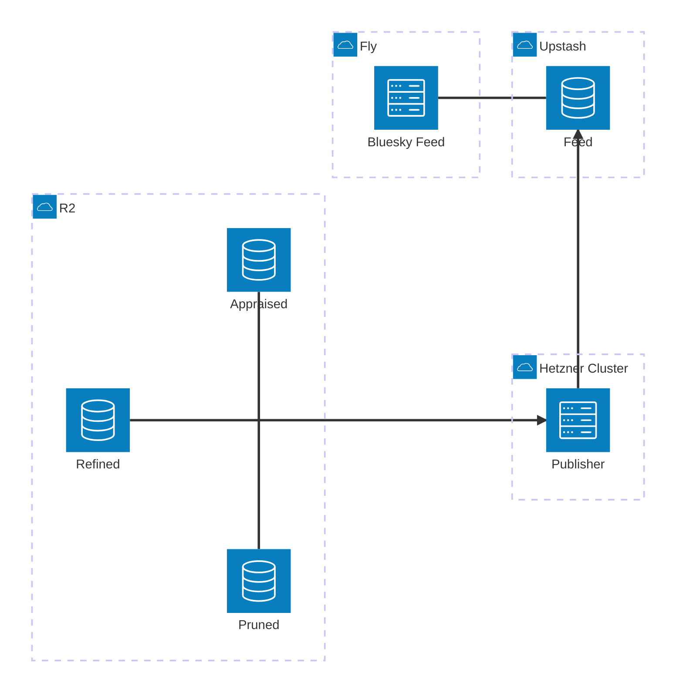

# Current Slice: Split out `skeet-feed`/`skeet-appraise`/`skeet-publish`

### Target

I want to get to the following different division of responsibilities:
* `skeet-feed`:
    * lives at `bobby-staging.houseofmoran.io`
    * handles:
        * bluesky feed
        * public website listing skeets ordered by recency and filtered by band >= MedHigh; this is a much simpler page than today's homepage (the current rich homepage moves to `skeet-appraise`)
    * bias is towards simplicity, reliability and speed (latency/cachability)
* `skeet-appraise`:
    * lives at `bobby-appraisals-staging` (the eventual MagicDNS FQDN `bobby-appraisals-staging.<tailnet>.ts.net`) within the hetzner cluster, accessible via tailscale
    * handles:
        * showing current status and editable controls (appraisals) for:
            * what is currently live as the feed (this is effectively the current `skeet-feed` homepage, moved here)
            * what has been found by the pruner and refiner for each skeet and associated images
        * manual appraisals (assigning High/MedHigh/MedLow/Low)
    * bias is towards ease-of-use and quick interactive updates
* `skeet-publish`:
    * runs in hetnzer k8s cluster like `live-refine` looking for changes to dependent tables
    * handles:
        * watching for changes in what skeets / images have been found and scored by a model as well as what has been appraised
        * determining what needs to be published as the feed; this is the canonical single place we decide this
        * this is where we apply the "ordered by recency and filtered by band >= MedHigh" from above i.e. the `skeet-feed` just blindly accepts the ordering specified by the publisher
        * publishing one redis list per **(order, limit)** choice, named `{order}-{limit}` — so the Bluesky feed is `recency-48h` and the public list (Phase 5) is `recency-7d`. `Order` is an enum (only `Recency` today = by skeet publish time; `Quality` = by score/band, later); `Limit` is a `NewType(Duration)` rendered `48h`/`7d`/`365d`. The publisher is configured with a *set* of these specs and computes/writes each generically; a reader just reads the named list it wants. Lists are named by ordering+window, deliberately **not** by visual use (no `grid`/`feed`).
        * resolving the public image URL for each published image — this is the **Bluesky CDN** URL (`https://cdn.bsky.app/img/feed_thumbnail/plain/{did}/{cid}@jpeg`), *not* our own annotated-image endpoint. The redis Feed stores `image-url:skeet-id` pairs, but whether the URL is read whole from the store, templated from a persisted blob `cid`, or derived some other way is hidden behind a trait — readers never know (see Phase 3 group A).
* `skeet-refine` stays as-is; `skeet-prune` needs one small addition — it builds the CDN URL today (`firehose.rs`) but **drops the `cid` at the classify stage**. Rather than add a store field, we carry the `cid` inside the image id itself via a new `ImageId::V3(BlueskyCid)` variant — no store-schema change, and existing code keeps treating `ImageId` opaquely. This is a prerequisite for Phase 5 rendering real images (see Phase 3 group A0).

The parts are related as follows by introducing a new redis table in upstash that sits between publisher and feed. The publisher writes `image-url:skeet-id` pairs into one named list per (order, limit) spec (resolving the image URL behind a trait). The Bluesky feed reads `recency-48h` and extracts a unique, ordered list of skeet-ids; the image URLs (Bluesky CDN, so images are served by Bluesky and never by us — which helps `skeet-feed` suspend) are used from Phase 5 onwards to render the public image list (`recency-7d`):



### Bugs / Refactors

#### Scope each Dockerfile to its crate with `-p`

##### Core, ahead of other work

* [x] audit each Dockerfile and map it to the single crate it ships, then scope both the chef cook and the final build to that crate:
    1. `Dockerfile.skeet-feed` → `-p skeet-feed` (bin `skeet-feed`)
    2. `Dockerfile.pruner` → `-p skeet-prune` (bin `pruner`)
    3. `Dockerfile.live-refine` → `-p skeet-refine` (bin `live-refine`)
    4. (no `Dockerfile.compact`/`Dockerfile.bench-firehose` exist; the other Dockerfiles are:)
        - `Dockerfile.optimise` → `-p skeet-store` (bin `optimise`)
        - `Dockerfile.cloudflare-exporter` → `-p cloudflare-exporter` (bins `sync_operations`, `sync_storage`)
        - `Dockerfile.openai-exporter` → `-p openai-exporter` (bin `sync_costs`)
* [x] in the builder stage, replace the workspace-wide cook with a scoped cook so only the crate's dependency subtree compiles:
    * `cargo chef cook --release -p <crate> --recipe-path recipe.json`
    * leave `cargo chef prepare` running over the whole workspace — the recipe is deps-only and can stay shared
* [x] replace the final `cargo build` with `cargo build --release -p <crate> --bin <bin>` so each image stops compiling sibling binaries. Kept `--bin` because several crates have many binaries (`skeet-prune` has 6, `skeet-refine` has 5); a bare `-p <crate>` would compile all of them.
* [x] **TLS / `deadpool-redis`:** the note originally said "`live-refine` / `skeet-refine`", but `skeet-refine` has no redis/`cot` dependency at all. The crate that uses `cot` + `deadpool-redis` + TLS-to-Upstash is **`skeet-feed`**, and it declares both directly, so the scoped `-p skeet-feed` cook keeps them in the same dependency subtree and the feature-unification HACK still applies. No `Cargo.toml` change was needed. *(Still needs Docker-build verification that TLS to Upstash works in the built `skeet-feed` image.)*

##### Discover / improve as we do this slice

* [x] verify caching actually improves: with deps unchanged, touch only `<crate>/src/main.rs`, rebuild, and confirm the cook/deps layer is reused (no dependency recompile). This is the direct test of whether `-p` + chef fixes the "recompiles everything" symptom for source-only changes. *(Confirmed — see `/tmp/cluster-deploy-20260601-110748.log`: a no-deps-change re-run came back fully cached, **37.99s** total, 0 `Compiling` lines, 71 `CACHED` layers.)*\
* [x] apply this same `-p` pattern when adding the `skeet-appraise` and `skeet-publish` Dockerfiles (Phases 1 and 3) rather than cloning a workspace-wide build
* Cross-image dedup + git-hash layer caching folded into "Fix cook setup → Tasks" below (see the shared `target/` cache mount task) — git-hash layer caching researched and rejected there.

##### Fix cook setup

###### Observations

####### based on /tmp/cluster-deploy-20260531-195315.log

Captured a full `cluster-deploy-all` run (`time BUILDKIT_PROGRESS=plain`) to see whether
chef caching actually helps. It doesn't — chef is currently providing **negative** value:

* **Total wall-clock was 2h13m** for the 5 arm64 images. Per image (cook = `cargo chef cook`,
  build = final `cargo build`):

  | image | cook | build |
  |---|---|---|
  | pruner | 998s | 1242s |
  | live-refine | 908s | 1245s |
  | optimise | 969s | 1025s |
  | cloudflare-exporter | 67s | 307s |
  | openai-exporter | 70s | 291s |

* **Every dependency is compiled twice.** For pruner the cook compiles **805 crates** and the
  build then recompiles **the same 805 crates from scratch** (e.g. `rustls-platform-verifier`,
  `tokio`, `serde` appear compiling in *both* steps). The cook step is pure waste, and the cache
  it produces is never reused — so chef gives no benefit even across runs (a cached cook layer is
  followed by a build that recompiles everything anyway).

* **Root cause: a RUSTFLAGS mismatch between cook and build.** In each Dockerfile the cook runs
  *before* `.cargo/config.toml` is present — only `recipe.json` is copied at that point; `COPY . .`
  brings `.cargo/config.toml` in *after* the cook. So:
  * cook compiles deps with **default rustflags** (no `.cargo/config.toml`);
  * build compiles deps with `[target.aarch64-unknown-linux-gnu] rustflags = ["--cfg",
    "tokio_unstable", "-C", "target-cpu=neoverse-n1"]`.
  * Different rustflags → different fingerprints → cargo discards the cooked artifacts and
    recompiles the whole dependency tree.
  * (`.cargo` is *not* in `.dockerignore`, so it is available to copy earlier.) This bug is in
    **all** the Dockerfiles, not just pruner.

* This also explains why the earlier `ENV BUILD_GIT_HASH` reorder didn't visibly help yet: even
  once the cook *layer* caches, the build recompiles every dep regardless. The earlier `-p`
  scoping was still worthwhile (it stops sibling *workspace* crates compiling) but its win is
  masked by this.

* **Second-order waste (separate from the bug):** the three heavy images each compile the shared
  third-party tree (`tokio`, `aws-sdk-s3`, `lancedb`, `image`, …) independently — ~16 min of dep
  compile × 3 — because each is a separate `buildx` build with its own `target/` and nothing is
  shared across images. This is the existing "dedup across images" item under "Discover / improve".

####### based on /tmp/cluster-deploy-20260531-222822.log

Re-ran after applying the `COPY .cargo/ .cargo/`-before-cook fix to **all 7** Dockerfiles. The
fix was **necessary but insufficient** — deps are *still* compiled twice, so the rustflags
mismatch was not the (only) cause. (Note: this log only captured pruner — 1 of 5 — the run was
cut short, but pruner alone is conclusive.)

* **No improvement.** Pruner cook still compiles **805 crates** and the build still recompiles
  **the same 805**. The build step got *slower* (1731s vs 1242s) and cook slower too (1266s vs
  998s) — consistent with both now compiling under the `target-cpu=neoverse-n1` flags (slower
  codegen) but still not sharing artifacts.

* **The real root cause: a rustc *toolchain* mismatch between cook and build.** The repo has a
  `rust-toolchain.toml` pinning `channel = "1.94"`. Same `COPY . .` ordering trap as the rustflags:
  * cook runs *before* `COPY . .`, so `rust-toolchain.toml` is absent → it uses the base image's
    default toolchain (no rustup sync in its log);
  * build runs *after* `COPY . .`, so the pin is present → rustup downloads & switches to
    **1.94.1** (visible at the top of the build step: `info: syncing channel updates for
    1.94-aarch64-unknown-linux-gnu` … `downloading 3 components`, ~243s before the first
    `Compiling`);
  * different rustc version → every fingerprint changes → all 805 deps recompile.

* So there are **two** config files that must be present at cook time for cook≡build:
  `.cargo/config.toml` (rustflags — already fixed) **and** `rust-toolchain.toml` (toolchain — still
  missing). Both arrive via `COPY . .` after the cook today; both must be copied before it.

* Neither is in `.dockerignore`, so both can be copied early.

####### based on /tmp/cluster-deploy-20260601-002150.log

Re-ran after applying **both** `COPY .cargo/ .cargo/` *and* `COPY rust-toolchain.toml
rust-toolchain.toml` before the cook in all 7 Dockerfiles. **The fix works** — the
double-compilation is gone.

* **Toolchain sync moved into cook.** `info: syncing channel updates for
  1.94-aarch64-unknown-linux-gnu` now fires at the *start of every cook* step (immediately after each
  `cargo chef cook` RUN). The build steps no longer print it — the pinned 1.94 toolchain is installed
  once, during cook, so cook and build now share one rustc.

* **Builds compile only first-party crates.** Cook owns the full dep tree; build reuses it:

  | image | cook (deps) | build | build compiles |
  |---|---|---|---|
  | pruner | 1201.8s, 805 deps | **45.9s** | 8 first-party crates |
  | live-refine | 1017.2s | **26.7s** | 5 |
  | optimise | 996.9s | **19.0s** | 3 |
  | cloudflare-exporter | 287.3s | **5.3s** | 3 |
  | openai-exporter | 276.7s | **3.9s** | 3 |

  Pruner's build dropped from **805 deps recompiled (1731s in the prior run)** to **8 crates / 45.9s**.

* **Total wall-clock: 1:09:42** vs the **2h13m baseline** — roughly halved, exactly the redundant
  second full dep compile per image that we eliminated.

* **Caveat — this was still a cold run.** ~63 of the 70 min is cook; deps + toolchain changed since
  the prior run so nothing was `CACHED`. The *next* consecutive `cluster-deploy-all` with unchanged
  deps should show every `cargo chef cook` as `CACHED`, collapsing the run to just the ~100s of
  first-party builds. That cached case is what proves the "verify caching actually improves" item —
  measured next (`110748` below).

* **Cross-image dedup still open.** Each of the 5 images cooks the shared dep tree independently
  (805 / … per image) because each is a separate `buildx` build with its own `target/`. Cutting the
  cold-cook case needs a `target/` cache mount shared across builds or a shared deps base image —
  the existing "dedup across images" item, to decide on next.

####### based on /tmp/cluster-deploy-20260601-110748.log

The cached-run proof. Re-ran `cluster-deploy-all` with **nothing changed** since `002150` (and after
an OrbStack restart, to check the BuildKit cache survived it). It did.

* **Fully cached, 37.99s total** (vs 1:09:42 cold, vs the 2h13m original baseline).
* **0** `Compiling` lines and **0** `1.94` channel syncs anywhere in the log.
* **71** `CACHED` layers — every `cargo chef cook` *and* every first-party `cargo build` reused, across
  all 5 images.
* The OrbStack restart did **not** invalidate the BuildKit layer cache or the registry/git
  `--mount=type=cache` mounts.
* So with deps unchanged the whole build phase is a no-op; the ~38s is just buildx resolving cache +
  push/deploy plumbing. This proves the "verify caching actually improves" item end-to-end.

###### Tasks

* [x] **Fix the flags mismatch.** Copy `.cargo/` in *before* the cook so cook and build share the
  same rustflags. Applied to all 7 Dockerfiles. *(Necessary but not sufficient on its own — see the
  toolchain task below.)*
* [x] **Fix the toolchain mismatch (the remaining blocker).** Also copy `rust-toolchain.toml` before
  the cook so cook installs & uses the pinned `1.94` toolchain too, e.g.:
  ```dockerfile
  COPY --from=planner /build/recipe.json recipe.json
  COPY .cargo/ .cargo/
  COPY rust-toolchain.toml rust-toolchain.toml
  RUN ... cargo chef cook ...
  ```
  Apply to all 7 Dockerfiles. Expectation: cook compiles the deps once under 1.94 + the real
  rustflags, build reuses them and only recompiles first-party crates (~30–60s).
* [x] **Re-run the experiment to confirm.** A second consecutive `cluster-deploy-all` with deps
  unchanged should show every `cargo chef cook` as `CACHED` and only the short first-party `build`
  running — that's the proof the "verify caching actually improves" item is after. Re-capture with
  `time BUILDKIT_PROGRESS=plain ... | tee` and compare total wall-clock against the 2h13m baseline.
  Confirm the build step no longer prints `syncing channel updates for 1.94` (it would mean the
  toolchain is still arriving late). *(Confirmed — `/tmp/cluster-deploy-20260601-002150.log`: the
  `1.94` channel sync now fires at the **start of each cook** step, not the build. Each build now
  compiles only the first-party crates — pruner 8 crates / 45.9s vs 805 deps before; refine 26.7s,
  optimise 19.0s, cloudflare 5.3s, openai 3.9s. Total wall-clock **1:09:42** vs the 2h13m baseline.
  Caching across consecutive builds with unchanged deps not yet re-measured — this run still did
  full cooks because deps/toolchain changed since the prior run.)*
* [x] **Cross-image dep dedup via a shared builder stage + `--target`.** Same-machine
  *repeat* builds are already a no-op (37.99s, log 110748); the remaining cost is the cold
  case where each image cooks the shared dep tree into its own `target/` (~63 min).
  **Done differently than first planned — two approaches tried and rejected before landing
  on this one:**
    1. *Pushed multi-arch deps base image* (Option B, `FROM bobby-deps:<hash>`): built fine but
       unpushable — a cooked release `target/` for the whole workspace × 2 arches is tens of GB;
       the cold push ran `pushing layers 37547.5s` (10.4h) then failed, the warm push hit repeated
       `502 Bad Gateway` (logs `cluster-deploy-deps-base-cold/warm`). The push dwarfed the re-cook.
    2. *Per-service Dockerfiles sharing one `target/` cache mount*: warm stayed a no-op but cold
       was **no better than baseline** (~69 min, log `cluster-deploy-cachemount-cold`) — `cargo
       build -p X` resolves a different feature set per crate, so shared deps were rebuilt as
       feature-variants in every image (refine recompiled 274 deps, publish 155, …).

  Landed: **one builder stage per platform** (`Dockerfile.cluster` arm64, `Dockerfile.fly`
  amd64) that compiles every shipped binary in a single `cargo build` (one feature resolution →
  deps once), with thin `runner-<name>` stages selected via `--target`. BuildKit reuses the one
  cached builder across all `--target` builds, so the heavy compile happens once. (Also surfaced:
  the amd64 cook is QEMU-emulated on Apple Silicon, ~72 min vs ~19 min native arm64.)
    * [x] `Dockerfile.cluster` / `Dockerfile.fly`: shared `builder` (registry+git+arch-scoped
      `target/` mounts; one multi-`-p`/`--bin` build; binaries + pruner's `.bpk`/`.rten` copied
      out to `/build/out/`; `BUILD_GIT_HASH` set for all — fixes the web/refine/etc. images that
      previously baked `unknown`) + `runner-base` + one `runner-<name>` per service.
    * [x] `container.just`: every `build-*`/`push-*` points at `-f Dockerfile.<cluster|fly>
      --target runner-<name>`. The 8 per-service Dockerfiles deleted. `cluster.just`/`feed.just`/
      `appraise.just` carry no base-image/deps plumbing.
    * [x] Update `.claude/rules/docker.md` (document the shared builder + `--target`; record why
      the pushed base and the per-service cache mount were both rejected).
    * [x] Re-measure cold and warm `cluster-deploy-all` vs the 1:09:42 / 37.99s baselines —
      confirmed. True cold (`docker buildx prune -af`, logs `cluster-deploy-cachemount-cold3`/
      `warm3`): the first `--target` build (push-pruner) compiled the **whole tree once** —
      `#13 DONE 1640.7s` (~27 min), 836 crates incl. all first-party and cold crate
      re-downloads — and the other five all showed `#12`/`#13 CACHED` (0 compiles). Warm:
      `0 Compiling`, every `#12 CACHED`. So deps compile once instead of per-image; even with
      pruned download caches the single builder compile is well under half the 1:09:42 baseline,
      and the other five images cost ~nothing. (Earlier partial-cold run `cold2` showed the same
      structure with a warm mount: 125 crates, `#12 DONE 927.1s`.)

* [~] **Exploit git-hash for layer caching — won't do.** BuildKit keys layers on content
  (recipe.json hash for the cook layer), not image tags; `BUILD_GIT_HASH` only busts the
  final build layer by design. No extra caching available beyond `:latest` as a cache-from
  ref. Superseded by the shared `target/` cache mount item above.

* [~] **Registry cache export — won't do for now.** `--cache-to type=registry,mode=max` +
  `--cache-from` would let a *different* builder (CI, a fresh machine) pull BuildKit's layer
  cache and skip the cold compile. Decided not worth it while builds stay on this one persistent
  warm OrbStack — the local layer cache + `target/` mount already survive across builds (38s
  warm), so cold is rarely paid. It also can't give cross-machine *incremental* compiles (the
  compiled `target/` is a cache mount, which registry cache export doesn't carry — only image
  layers). Revisit only if image builds move to CI/multiple machines. (Bonus if we ever do: it
  wouldn't hit the deps-base GHCR push wall — `target/` being a mount means the exported cache
  layers are just source + the small `/build/out/` binaries.)

* [x] **Fix the flags mismatch (the primary fix).** Copy `.cargo/` in *before* the cook so cook and
  build share one fingerprint, e.g. between the `recipe.json` copy and the cook step:
  ```dockerfile
  COPY --from=planner /build/recipe.json recipe.json
  COPY .cargo/ .cargo/
  RUN ... cargo chef cook ...
  ```
  Apply to **all** Dockerfiles (`pruner`, `live-refine`, `optimise`, `cloudflare-exporter`,
  `openai-exporter`, `skeet-feed`, `skeet-appraise`). Expectation: cook compiles the deps once,
  build reuses them and only recompiles first-party crates (~30–60s).
* [x] **Re-run the experiment to confirm.** A second consecutive `cluster-deploy-all` with deps
  unchanged should show every `cargo chef cook` as `CACHED` and only the short first-party `build`
  running — that's the proof the "verify caching actually improves" item is after. Re-capture with
  `time BUILDKIT_PROGRESS=plain ... | tee` and compare total wall-clock against the 2h13m baseline.

#### Deny `expect()` as well

`expect()` is probably as bad an idea in main code as `unwrap()` so deny that as well, and instead prefer explicit Result+Err, unless in tests.

* [x] similar to `unwrap_used = "deny"` and `allow-unwrap-in-tests = true` do the same for expect, and fix all related issues
    * [x] for places where we are removing possibly useful expect messages about *why* something failed, replace these instead with usage of an explicit error enum using `thiserror` (see `rust.md` for advice + see other examples of usage inside codebase)
* [x] add a note about this to @rust.md like we do for `unwrap`

#### Prefer infallible construction over `expect` for proven invariants
 
When a value is **provably in range by construction**, don't route it through a
validating constructor and `expect` the success. Give the newtype an infallible
constructor that *owns the computation*, so the invariant lives next to the type
and there is no panic path to suppress.

##### Before
 
`ConfusionMatrix` computes the ratio, then validates a value it already knows is valid:
 
```rust
pub fn precision(&self) -> Option<Precision> {
    let denom = self.true_pos + self.false_pos;
    if denom == 0 { return None; }
    let value = self.true_pos as f64 / denom as f64;
    // requires #[allow(clippy::expect_used)] + a justifying comment
    Some(Precision::new(value).expect("precision in [0, 1] by construction"))
}
```
 
##### After
 
Move the computation into the type. `Precision::new` stays as the fallible
*validating* constructor for untrusted input; `from_counts` is infallible because
`tp <= tp + fp` (preserved by the monotone `u64 as f64` cast):
 
```rust
impl Precision {
    /// precision = tp / (tp + fp); `None` iff tp + fp == 0.
    /// Always in [0, 1]: tp <= tp + fp, preserved by the f64 cast.
    pub fn from_counts(true_pos: u64, false_pos: u64) -> Option<Self> {
        let denom = true_pos + false_pos;
        (denom != 0).then(|| Self(true_pos as f64 / denom as f64))
    }
}
 
// caller becomes a one-line delegation:
pub fn precision(&self) -> Option<Precision> {
    Precision::from_counts(self.true_pos, self.false_pos)
}
```
 
For `f1`, take already-validated inputs so their `[0, 1]`-ness is guaranteed by
their *types*, leaving only one small real lemma (harmonic mean of two `[0, 1]`
values stays in `[0, 1]`):
 
```rust
impl F1 {
    pub fn harmonic(p: Precision, r: Recall) -> Self {
        let (p, r) = (f64::from(p), f64::from(r));
        let denom = p + r;
        Self(if denom == 0.0 { 0.0 } else { 2.0 * p * r / denom })
    }
}
 
// f1(): Some(F1::harmonic(self.precision()?, self.recall()?))
```
 
No `expect`, no `#[allow(clippy::expect_used)]` — the panic path is gone rather
than asserted unreachable.
 
##### The pattern
 
- Keep the **validating** constructor (`new` → `Result`/`Option`) for untrusted input.
- Add an **infallible** constructor that owns the computation guaranteeing the invariant
  (`from_counts`, `harmonic`, ...).
- Accept already-validated newtypes as inputs so the type system carries the invariant
  forward, shrinking what's left to prove.
- Result: invalid states are unconstructable at the call site, so there's no panic to
  `allow` away.

###### Tasks

* [x] Apply this advice to the mentioned code
* [x] Also check out for other instances where this pattern could apply (based on where we are currently having to apply `#[allow(clippy::expect_used)]`)

### Phases

We'll do this in phases, with a working system at each step

#### Phase 1: Split out `skeet-publish` as a library

This is not introducing a new service, but instead is factoring out the code already in `skeet-feed` which is to do with caching and generating a feed to instead live in a `skeet-publish` crate. This should live behind a trait which abstracts away as much detail as possible. The `skeet-feed` should depend only on this trait.

The trait surface should be **narrow** — `skeet-feed`'s `getFeedSkeleton` only needs an ordered, unique, visibility-filtered list of skeet-ids plus a `refreshed_at` for the `last-modified` header (image-urls get added to the surface in Phase 3/5, not now). The richer `CachedFeed` (entries + scores + appraisal maps) also moves into `skeet-publish` because the appraise homepage will consume it in Phase 2 — but it is *not* part of the `skeet-feed`-facing trait.

Transitional note: until Phase 2 moves `home`/`annotated_image` out, those handlers stay in `skeet-feed` and keep using the relocated `CachedFeed` directly. "`skeet-feed` depends only on the trait" is fully realised at the end of Phase 2; in Phase 1 it holds for the feed-generation path (`getFeedSkeleton`).

This is a pure refactor: no new service, no infra, no behaviour change. The existing `feed_endpoints` / `feed_integration` tests are the safety net — `getFeedSkeleton` output, `last-modified`, and `cache-control: no-cache` handling must stay byte-identical.

Tasks:

* [x] **Create the `skeet-publish` crate** (lib only): add to workspace `members` and a `skeet-publish = { path = "skeet-publish" }` entry in `[workspace.dependencies]`; `[lints] workspace = true`. Deps: `skeet-store`, `shared`, `chrono`, `tokio`, `tracing` (add `image` only if a moved type needs it). *(Also added `async-trait` for the `FeedSource` trait; no `image` needed.)*
* [x] **Move feed-generation policy** out of `skeet-feed` into `skeet-publish`, with its unit tests:
    * `effective_band.rs` (`image_effective_band`, `image_score_is_positive`) — this is the per-model visibility/scoring decision; per the rust rule, policy belongs in the crate that owns the decision (`skeet-publish`).
    * `visible_skeet_ids` / `visible_entries` (now in `skeet-publish/src/visibility.rs`).
* [x] **Move the cache** `feed_cache.rs` (`FeedCache`, `CachedFeed`, `spawn_background_refresh`) into `skeet-publish`, with its tests. Keep the cot middleware `FeedCacheLayer`/`FeedCacheExtractor` in the web crate(s) for now — they wrap the relocated `FeedCache`; only the cache type + refresh logic move. *(Middleware stays in `skeet-feed/src/feed_cache_middleware.rs`.)*
* [x] **Define the trait + live impl** in `skeet-publish` (`source.rs`):
    * `trait FeedSource` (async) → returns ordered, unique, visibility-filtered `Vec<SkeetId>` + `refreshed_at: Option<DateTime<Utc>>` (wrapped in `FeedSkeleton`), with a force-refresh path (to back `cache-control: no-cache`).
    * `LiveFeedSource` implementing it over `FeedCache` + `visible_entries`.
* [x] **Rewire `skeet-feed`**:
    * `get_feed_skeleton` depends only on `Arc<dyn FeedSource>` (injected via `FeedSourceLayer`/`FeedSourceExtractor`) instead of `FeedCacheExtractor`; applies `take(limit)` + last-modified exactly as today.
    * `did_document` / `describe_feed_generator` are unchanged (use `FeedConfig`).
    * `home` / `annotated_image` stay (transitional) using the relocated `CachedFeed` via `FeedCacheExtractor`.
    * Added `skeet-publish` to `skeet-feed/Cargo.toml`; deleted the now-moved local modules (`effective_band.rs`, `feed_cache.rs`, `visibility.rs`).
* [x] **Wire the bin** `skeet_feed.rs`: construct `FeedCache` → wrap in `LiveFeedSource` → inject as `Arc<dyn FeedSource>` via `FeedSourceLayer`; keep `spawn_background_refresh`.
* [x] **Verify**: `just clippy` (clean); `just test-no-docker` (442 passed, 5 skipped — feed tests pass unchanged); both `lib.rs` files well under 300 lines (`skeet-publish` 10, `skeet-feed` 22).

#### Phase 2: Split out `skeet-appraise` as a standalone website

Even though we want to ultimately make this run within the hetzner cluster and be accessible over tailscale, initially we'll introduce a new fly.io website at `bobby-appraisals-staging.houseofmoran.io`. 

This can effectively copy/clone setup we already have for `bobby-staging.houseofmoran.io` as we are largely splitting out existing code.

After Phase 1 the shared feed/cache code lives in `skeet-publish`, so both web crates depend on it cleanly (no `skeet-appraise` → `skeet-feed` dependency). `skeet-appraise` consumes the richer `CachedFeed`; `skeet-feed` keeps only the narrow `FeedSource` trait.

Route split:
* **stays in `skeet-feed`** (the Bluesky feed): `/.well-known/did.json`, `app.bsky.feed.describeFeedGenerator`, `app.bsky.feed.getFeedSkeleton`.
* **moves to `skeet-appraise`** (the appraisal UI): `/` (rich home), `/skeet/{image_id}/annotated.png`, `/admin`, `/admin/appraise/{skeet,image}`, `/auth/{login,callback,logout}`.

Tasks:

* [x] **Create the `skeet-appraise` crate** with bin `skeet-appraise` at `src/bin/skeet_appraise.rs`; added to workspace `members`. Mirrors `skeet-feed/Cargo.toml` deps + `skeet-publish`, declares `deadpool-redis` directly (the cot + deadpool-redis TLS-to-Upstash feature-unification HACK), and has its own `build.rs` (`emit_git_hash`).
* [x] **Move the appraisal/admin/auth code** out of `skeet-feed` into `skeet-appraise`, with templates and tests:
    * `home` handler + `home.html` + `HomeEntry`, and `band_options`/`BandOption` (now in `skeet-appraise/src/handlers.rs`).
    * `admin.rs` + `admin.html` / `admin_page.html` / `admin_row.html` + `appraise_skeet` / `appraise_image` (`git mv`).
    * `auth.rs` + `auth_config.rs` (`OAuthConfig` + layer/extractor) (`git mv`).
    * `annotated_image` handler (in `skeet-appraise/src/handlers.rs`).
    * `appraiser_config.rs`, `started_at.rs`, `store_middleware.rs`, `static_assets.rs` (+ `static/htmx.min.js`) (`git mv`).
    * `effective_band` consumed from `skeet-publish` (Phase 1).
* [x] **Build the `AppraiseProject` + router** (`/`, `/skeet/{image_id}/annotated.png`, `/admin`, `/admin/appraise/{skeet,image}`, `/auth/{login,callback,logout}`). Middleware: StaticFiles, Session (redis/in-memory), `FeedCacheLayer`, `Store`, `Appraiser`, `OAuthConfig`, `StartedAt`. No `FeedConfig`.
* [x] **Write the bin** `skeet_appraise.rs` cloned from `skeet_feed.rs` minus the bsky-identity args: keeps `--store-path`, `--model-path`, `--max-entries`, `--max-age-hours`, `--bind`, `--local-admin`, and the OAuth/session/redis args. Constructs `FeedCache` + `spawn_background_refresh`, injects via `FeedCacheLayer`.
* [x] **Trim `skeet-feed`**:
    * Router keeps the three feed endpoints; `/` is a minimal static placeholder until Phase 5.
    * Dropped now-unused deps (`oauth2`, `tower-sessions`, `deadpool-redis` + its TLS HACK, `image`, `urlencoding`) — clippy/tests confirm.
    * Simplified the `skeet-feed` bin Args (dropped github/session/redis/admin/local-admin) and `fly.staging.toml` process args (dropped `--use-redis`). *(Removing the OAuth/session/redis secrets from the `bobby-staging` fly app is an operational `fly secrets` step — see "external follow-ups" below.)*
* [x] **Re-home the integration tests** (public HTTP interface):
    * stays in `skeet-feed`: `did.json`, `describeFeedGenerator`, `getFeedSkeleton` (`feed_integration.rs`, feed half of `feed_endpoints.rs`).
    * moved to `skeet-appraise`: home/admin/appraise/auth (`appraise_endpoints.rs`) + `redis_session.rs` + `common/mod.rs`. The cross-cutting "appraise-then-feed-visibility" cases stay in `skeet-feed`'s `feed_endpoints.rs` but now seed appraisals via the store and assert against `getFeedSkeleton`.
    * new live-server coverage for the moved endpoints: `skeet-appraise/tests/appraise_integration.rs` mirrors `feed_integration.rs` (spawns the bin locally, or hits `TEST_BASE_URL`) and asserts the unauthenticated surface that holds in both modes — `/` renders, `/static/htmx.min.js` served, `/admin` redirects to login. This is what `end_to_end_test_appraise_staging` runs against staging (the feed-endpoint `feed_integration.rs` was already feed-only, so nothing was removed from it).
* [x] **Build/deploy plumbing**:
    * `Dockerfile.skeet-appraise` (scoped `-p skeet-appraise --bin skeet-appraise`, `linux/amd64`, copies `config/refine.toml`).
    * `just/container.just`: `build-skeet-appraise` / `push-skeet-appraise`.
    * `fly.appraise-staging.toml` (app `bobby-appraisals-staging`, `OTEL_SERVICE_NAME=skeet-appraise`, `RUST_LOG=skeet_appraise=info,skeet_store=info`, health check on `/`).
    * `just/appraise.just` (imported in `justfile`): local run, `deploy_appraise_staging_secrets` / `deploy_appraise_staging_app`, `end_to_end_test_appraise_staging` (runs `appraise_integration` against `bobby-appraisals-staging.fly.dev`).
* [x] **Secrets / OAuth / DNS / fly app** *(external — needs credentials/consoles, cannot be done from the repo)*:
    * [x] create `bobby-appraisals-staging.env` (S3, SSE-C, OTEL, github oauth, session secret, admin users, redis url).
        * some names of secrets not yet created
    * [x] build with `Dockerfile.skeet-appraise` for first time via `just push-skeet-appraise`
    * [x] `fly apps create bobby-appraisals-staging`
    * [x] deploy
        * [x] `just deploy_appraise_staging_app`
            * need to go to https://github.com/users/mikemoraned/packages/container/bobby%2Fskeet-appraise/settings and make this package public for this to start
            * this will get to starting the system but will probably fail as no secrets yet deployed
        * [x] `just deploy_appraise_staging_secrets`
        * this will create https://bobby-appraisals-staging.fly.dev
    * [x] create DNS in Route53 which maps `bobby-appraisals-staging.houseofmoran.io` to `bobby-appraisals-staging.fly.dev`
    * [x] add cert for the hostname
        * `fly certs add bobby-appraisals-staging.houseofmoran.io --app bobby-appraisals-staging`
        * `fly certs check bobby-appraisals-staging.houseofmoran.io --app bobby-appraisals-staging` to check status
    * [x] New GitHub `bobby-appraisals-staging` OAuth app:
        * application name: `bobby-appraisals-staging`
        * homepage url: `https://bobby-appraisals-staging.houseofmoran.io/`
        * authorization callback url: `https://bobby-appraisals-staging.houseofmoran.io/auth/callback`
        * [x] store client id/secret in 1Password:
            * [x] `op://Dev/bobby-github-oauth-appraisals-staging-client-id/password`
            * [x] `op://Dev/bobby-github-oauth-appraisals-staging-client-secret/password`
        * [x] try login by going to `https://bobby-appraisals-staging.houseofmoran.io/admin`
    * [x] confirm appraise is working by running `just end_to_end_test_appraise_staging`
    * [x] fresh minimal deploy of https://bobby-staging.houseofmoran.io/ with confirmed removed functionality:
        * [x] define the known-needed secrets in a new per-service `bobby-feed-staging.env` (store creds + OTEL only — no github/session/redis/admin, and OPENAI dropped too since the feed never used it); point `deploy_staging_secrets` at it. `fly secrets import` only adds/updates, so the now-unneeded secrets are removed from the app *after* the deploy (below).
        * [x] do a deploy of `just deploy_staging`
        * [x] remove the now-unneeded secrets from the app (those on the app but absent from `bobby-feed-staging.env`):
        ```
        fly secrets unset --config fly.staging.toml \
          BOBBY_GITHUB_CLIENT_ID BOBBY_GITHUB_CLIENT_SECRET \
          BOBBY_SESSION_SECRET BOBBY_ADMIN_USERS BOBBY_REDIS_URL \
          BOBBY_OPENAI_API_KEY
        ```
* [x] **Verify**:
    * [x] `just clippy`, `just test-no-docker` (448 passed, 5 skipped), `lib.rs` files < 300 lines (`skeet-feed` 8, `skeet-appraise` 19).
    * [x] *(needs deploy)* `skeet-appraise`: home renders, OAuth login works, admin paging + set/clear band works, `annotated.png` served; `just end_to_end_test_appraise_staging` still green
    * [x] *(needs deploy)* `skeet-feed` unchanged: redeploy trimmed `bobby-staging`; `just end_to_end_test_staging` still green.
* [x] delete `bobby-staging` Github App as should no longer be needed
* [x] also archive the associated unneeded 1Password secrets (repo-wide grep confirms these two have no remaining references outside this checklist):
    * `bobby-github-oauth-staging-client-id`
    * `bobby-github-oauth-staging-client-secret`
    * NB: `bobby-session-secret`, `bobby-upstash-redis-tcp-url` and `hom-bobby-openai-key` are **still in use** (appraise sessions/redis, local dev, refiner/cluster) — do **not** delete them.
* [x] rename rules like `deploy_staging` to `deploy_feed_staging` (and similar just rules)

#### Phase 3: Turn `skeet-publish` into a service

This is where we introduce a new redis `feed` storage to act as the publishing destination which links `skeet-feed` and `skeet-publish`. we can do this in steps:
1. Create a new redis list in upstash — named by the `{order}-{limit}` scheme, so the Bluesky feed list is `recency-48h` (see group A) — containing `image-url:skeet-id` pairs (the publisher resolves the image URL), which represent the images which have been allowed through. `skeet-feed` reads these pairs and extracts a unique, ordered list of skeet-ids for the Bluesky feed
2. Create a new service which works like `live-refine` except it monitors and periodically recalculates the pairs (based on same logic as was in `skeet-feed` but has now been moved to this library), and then publishes this to the redis list. Deploy this to hetzner and leave running for an afternoon (verify manually that redis list makes sense).
3. Update `skeet-feed` to be configurable (via config flag) to either continue using the library implementation or reading from redis (using different implementations of same trait). Deploy this to staging with it told to use the redis input. Deploy and leave running for an afternoon and manually verify it makes sense.
4. If all good, remove implementation of trait that does live calculation and instead rely only on redis implementation.
5. Switch `skeet-feed` to be a suspendable service (see below)

##### `skeet-feed` as a suspendable Fly service: things to know

- **Eligibility:** ≤ 2 GB RAM, no swap, no GPU, machine updated since June 2024.
- **Redis connection dies on resume.** Upstash's idle timeout fires during suspension; local socket doesn't notice. Need a pool that validates before use, or retry-on-failure that reconnects + re-auths.
- **Same for any other long-lived outbound HTTP pools**
- **Every deploy invalidates the snapshot** — first request after deploy is a real cold start, not a resume. Keep the cold-start path fast (lazy-load from Redis, don't preload).
- **Tune `soft_limit`** on the HTTP service in `fly.toml` — controls how aggressively the proxy suspends. Default is too high for low-traffic staging.
- **Timers pause during suspend** and clock can lag a few seconds on resume. Use wall-clock for anything time-sensitive; don't trust `tokio::time::interval` cadence as real-time.
- **Logs and metric pushes can drop** across the suspend boundary. Don't alert on metric absence.
- **Keep health checks shallow**, or have them go through the same retry path as real requests.

##### Tasks

The five numbered steps above map onto groups A–E. Each group ends at a deployable, manually-verifiable state (run new + old alongside each other; only remove the old path once the new one is confirmed).

###### A0. Prerequisite — carry the Bluesky CID in `ImageId::V3` (land this early)

This is a self-contained, backward/forward-compatible migration that can be done ahead of (or in parallel with) the earlier phases. The roll-out order matters: **every service must be able to *parse* `v3:` ids before the pruner starts *writing* them.**

* [x] **Add `ImageId::V3(BlueskyCid)`** in `shared`: a `BlueskyCid` newtype (FromStr/`new` + validation per the NewType rule — consider the `cid` crate rather than hand-rolling CID parsing), a `v3:`-prefixed `Display`, and matching `FromStr`/serde (the existing string-based serde then handles it transparently). Add round-trip + unknown-prefix tests. Keep `from_image` (V2) as the constructor for tests and anything content-addressing decoded pixels. *(`BlueskyCid` validates via the `cid` crate, which was already in the tree transitively via `atrium-api` → `ipld-core` — so the same parser that produces blob-ref CIDs accepts these strings; declared it directly on `shared`.)*
* [x] **Audit `ImageId` usage for re-derivation** (done for this analysis, re-confirm after edits): the only **production** `ImageId::from_image` is `skeet-prune/classify.rs:152`; the refine pipeline gets ids from the store (`get_originals_by_ids`), and all other `from_image` calls are `#[cfg(test)]` fixtures. So no production path recomputes an id from pixels and compares — V3 ids flow through opaquely. Note the **dedup-semantics shift**: V2 keys on md5 of decoded pixels (collapses re-encodes of the same image), V3 keys on the blob cid (collapses only identical uploaded blobs) — acceptable, but record it.
* [x] **Compile + deploy every service** that touches the store on this version *before* flipping the pruner, so each can read `v3:` ids. No behaviour change yet (pruner still emits V2).
* [x] **Flip `skeet-prune` to emit V3**: thread the `cid` from `extract_skeet_candidate` (it already has it — currently only embedded in the `image_urls` strings, `firehose.rs:108`) through `SkeetCandidate` → `SkeetImage` → `classify.rs`, and build `ImageId::V3(cid)` instead of `from_image`. From here, new images are V3; old V1/V2 rows are untouched. *(Replaced `SkeetCandidate.image_urls: Vec<String>` with `images: Vec<ImageCandidate { cid, url }>` so each downloaded image carries its parsed `BlueskyCid`; `blob_cid` now parses to `BlueskyCid` at the firehose edge.)*
* [x] **Accept the limitation**: `skeet-publish` can only resolve a CDN URL for `ImageId::V3` ids (it needs the cid). V1/V2 images have no recoverable cid, so they can't be published *with an image URL* — but the feed is recency-filtered (~48h / past week), so V1/V2 age out of the window shortly after this lands. Until then the resolver returns `None`/placeholder for them.

###### A. Define the published-list redis schema (`{order}-{limit}`, shared in `skeet-publish`) — step 1

* [x] **The image URL is the Bluesky CDN URL, resolved behind a trait.** Target shape: `https://cdn.bsky.app/img/feed_thumbnail/plain/{did}/{cid}@jpeg` — `did` from the skeet-id, `cid` from the `ImageId::V3` (see A0). Introduce an `ImageUrlResolver` trait (in `skeet-publish`) mapping a published image → `Option<ImageUrl>`, hiding whether the value came from a V3 cid, a stored url, or elsewhere; it returns `None` for non-V3 ids. The publisher resolves at publish time so `skeet-feed` stays dumb. (Thumbnail vs fullsize template is a Phase 5 choice.) *(`image_url_resolver.rs`: trait `ImageUrlResolver::resolve(&SkeetId, &ImageId) -> Option<ImageUrl>` + `CdnImageUrlResolver`. Kept it **sync** — the CDN URL is a pure string build; a future store-backed resolver can pre-load a map. `ImageUrl` (`image_url.rs`) wraps a parsed `url::Url` and rejects non-`https`, so a constructed value is always a valid url.)*
* [x] **Name lists by `{order}-{limit}`, with typed components.** Add an `Order` enum (`Recency` only today → by skeet publish time; designed to grow a `Quality` variant later) with `Display`/`FromStr` (`recency`), and a `Limit(Duration)` NewType (FromStr/`new` + `Display` for `48h`/`7d`/`365d` — prefer a duration-parsing dep over hand-rolling). The redis list name is `format!("{order}-{limit}")`, so the Bluesky feed list is `recency-48h`. Don't name by visual purpose (no `feed`/`grid`). *(Deviation: `Limit` stores `count` + a `Hours`/`Days` unit, **not** a bare `Duration`. The rendered form *is* the list name, so the unit must be preserved — `48h` must not normalise to `2d`. No duration crate round-trips a chosen unit (humantime renders `48h` as `2days`), so the `<count><h|d>` grammar is parsed in one go by a compiled `regex` (`^([0-9]+)([hd])$`) in `impl TryFrom<&str> for Limit`; `Limit::window()` exposes the `chrono::Duration` for filtering. `order.rs` / `limit.rs`.)*
* [x] **Decide the redis encoding before writing any redis code.** A skeet-id is an AT-URI (`at://did:plc:…/app.bsky.feed.post/rkey`) and the image-url is `https://…`, so a bare `image-url:skeet-id` string is ambiguous (both halves contain `:`). Encode each list element as a JSON object `{ "image_url": …, "skeet_id": … }` via a typed `PublishedPair` struct (serde) — not a delimiter-split string. The `image_url` stored here is the already-resolved CDN URL. Lists are always **per-image** pairs; deduplication (e.g. to unique skeet-ids for `getFeedSkeleton`) is a *read-side* concern, not part of a list's identity. *(`published_pair.rs`; a test asserts the JSON object shape.)*
* [x] **Own the schema in one place** in `skeet-publish`, consumed by both the publisher (write) and `skeet-feed` (read): the `Order`/`Limit` types + `{order}-{limit}` naming, the `PublishedPair` type, its serialization, and the read/write helpers. Add serialization + list-name round-trip unit tests. *(`published_list.rs`: `PublishedList::{new,name,replace,read}` over a generic `redis::aio::ConnectionLike` connection — uses the low-level `cmd().exec_async()`/`query_async()` API to stay generic over a `&mut C` connection. Unit tests cover the name; serde round-trips in `published_pair.rs`/`image_url.rs`; the redis round-trip is the testcontainers test below.)*
* [x] **Make replacement atomic.** The publisher recomputes each list every cycle; readers must never see a half-written list. Build into a temp key and `RENAME` over the target list (e.g. `recency-48h`) — RENAME is atomic. *(`replace()` builds into `{name}:building` then `RENAME`s over `{name}`; empty input deletes the key. `testcontainers` redis tests in `skeet-publish/tests/redis_published_list.rs` (`_docker`-suffixed → skipped by `just test-no-docker`, run via `just test`) cover round-trip, atomic overwrite-leaves-no-remnants, empty-clears, and name non-collision. **Not yet run** — needs Docker, which the sandbox lacks; run `just test` before deploying.)*
* [x] **The image-url half isn't consumed until Phase 5** — `getFeedSkeleton` only reads the skeet-id half. So get the *skeet-id* half exactly right now; the resolved `image_url` just needs to be present and plausibly correct. *(Each `PublishedPair` carries both halves; the skeet-id is a real `SkeetId`. `refreshed_at` is deliberately **not** part of the group-A schema — the reader returns it in group B.)*

###### B. Build the publisher (library + service) — step 2

**Two separate Upstash servers** (decided here, used from B onward): we do **not** share one redis between the admin/session use-case and the publish use-case. There are now two dedicated servers, each with its own env var + 1Password item:

| use-case | who | env var | 1Password item |
|---|---|---|---|
| admin sessions | `skeet-appraise` | `BOBBY_REDIS_ADMIN_URL` | `bobby-upstash-redis-admin-tcp-url` |
| published lists | `skeet-publish` (write), `skeet-feed` (read, group C) | `BOBBY_REDIS_PUBLISH_URL` | `bobby-upstash-redis-publish-tcp-url` |

Both servers + 1Password items already exist. The old `BOBBY_REDIS_URL` / `bobby-upstash-redis-tcp-url` pairing (only ever used by `skeet-appraise` sessions — the Phase-2 note at line ~454 claiming local-dev/refiner use is stale) is **renamed to the admin one**; the old fly secret is removed after deploy.

###### B0. Rename `skeet-appraise`'s session redis to the admin server — prerequisite

* [x] **Code**: in `skeet-appraise/src/bin/skeet_appraise.rs`, rename the arg `redis_url` (env `BOBBY_REDIS_URL`) → `redis_admin_url` (env `BOBBY_REDIS_ADMIN_URL`); update the wiring at the `AppraiseProject { redis_url: ... }` site. The `project.rs` field stays `redis_url` (it's the session-store url, server-agnostic) — only the bin's arg/env name changes. No behaviour change.
* [x] **Env**: `bobby-appraisals-staging.env` — `BOBBY_REDIS_URL=op://Dev/bobby-upstash-redis-tcp-url/password` → `BOBBY_REDIS_ADMIN_URL=op://Dev/bobby-upstash-redis-admin-tcp-url/password`.
* [ ] **Deploy + remove old fly secret** *(external)*: `just deploy_appraise_staging_secrets` (imports `BOBBY_REDIS_ADMIN_URL`) → `just deploy_appraise_staging_app`, then once the new code is live, drop the now-unused old secret: `fly secrets unset --config fly.appraise-staging.toml BOBBY_REDIS_URL`. Confirm `/admin` login (sessions land in the admin server) via `just end_to_end_test_appraise_staging`.

* [x] **Publisher logic in `skeet-publish`**: a `FeedPublisher` configured with a *set* of `(Order, Limit)` specs. For each spec it reuses the Phase-1 **visibility** policy (`visible_skeet_ids` / `visible_entries`) to decide *which* skeets are allowed, then applies the spec's **own ordering and window**: for `Order::Recency`, sort the visible entries by skeet publish time (`StoredImageSummary.original_at`, newest first) and keep only those within `Limit::window()` of now. It then resolves each image URL via the `ImageUrlResolver` (group A) and writes the atomic replacement to the `{order}-{limit}` list. In Phase 3 the set is just `{ recency-48h }`; Phase 5 adds `recency-7d` with no new publisher code. *(Done — `publisher.rs`: `pairs_for_spec` (pure, unit-tested: recency order / window / visibility / non-V3-drop / manual-band) + `FeedPublisher::{fetch,publish}`. Store query `list_scored_summaries_published_since` added in `scores.rs` (+ test). Visibility decoupled via the `FeedData` trait (`visibility.rs`), implemented by `CachedFeed` (zero call-site churn) and `WindowedFeed`. The `FeedPublisher::publish` store+redis path is exercised by the equivalence test below, not unit tests.)*
    * **Ordering decision (resolved):** the publisher does **not** reuse `visible_entries`' ordering — that path is *score*-ordered (`FeedCache` → `list_scored_summaries_by_score`, capped by `max_entries`). `Order::Recency` means publish-time order, windowed by `Limit`, with **no** `max_entries` cap; only the visibility *filter* is shared. `LiveFeedSource` keeps its score ordering for the still-live library path (removed in group D); the live Bluesky feed's order changes from score → recency naturally when `skeet-feed` starts reading the redis list in group C.
    * **Data fetch + visibility (decided — supersedes the earlier top-100-by-score idea):** the publisher does **not** route through `FeedCache` / `list_scored_summaries_by_score` (top-100 *by score*, capped at `MAX_SCORED_SUMMARIES = 100`) — that cap means a recent but low-score visible skeet outside the top 100 would be dropped. Instead, add a new store query `list_scored_summaries_published_since(cutoff)` that returns **all** scored skeets with `original_at >= cutoff`, **uncapped** (reuse `cached_scores` + a new `original_at` id-filter + `fetch_summaries_for_scores`). The publisher queries `cutoff = now − max(spec windows)`, also fetches the skeet/image appraisal maps + models, runs the visibility policy, then per spec windows by `original_at` and sorts recency-desc. So there is **no** score-truncation universe and **no** `max_entries`/`FeedCache` involvement.
        * **Decouple visibility via a trait:** to run the visibility policy on the publisher's freshly-queried data *without* building a `CachedFeed` or depending on `FeedCache`, make `visible_skeet_ids` / `visible_entries` generic over a small `FeedData` trait — `entries()`, `image_band(&ImageId)`, `skeet_band(&SkeetId)`, `models()`. `CachedFeed` implements it (so `LiveFeedSource` / `skeet-appraise` call sites are **unchanged** — they still pass `&CachedFeed`), and the publisher implements it on its own windowed-query type. The publisher's type holds the same four kinds of data, but that's data shape behind a shared policy, not duplicated logic.
    * **Non-resolvable images:** entries whose representative image can't resolve to a CDN url (non-`V3` ids) are dropped from the list (the A0 transition limitation — they age out of the window). Equivalence tests use `V3` fixtures so resolution always succeeds and the set-equality holds.
* [x] **Add a generic redis reader** in `skeet-publish` — `RedisPublishedList::new(order, limit)` → `Vec<PublishedPair>` + `refreshed_at`. Then `RedisFeedSource` (the Phase-1 `FeedSource` impl `skeet-feed` uses in group C) wraps the `recency-48h` reader and dedups to a unique, ordered list of skeet-ids. *(Done — the reader is the existing `PublishedList` (not a separate `RedisPublishedList` name): added `PublishedList::refreshed_at` read + a `{name}:refreshed-at` companion key written by `replace` (written last, so a racing reader never pairs a newer timestamp with an old list). `RedisFeedSource` (`source.rs`) reads it and dedups to skeet-ids. The `FeedSource` trait error became `FeedSourceError` (wraps `StoreError` + `PublishedListError`); the `skeet-feed` handler is unaffected (it formats `{e}`).)*
* [x] **Redis client / TLS**: the worker isn't a cot app, so use `deadpool-redis` (or `redis`) with rustls directly against the `rediss://` Upstash URL — independent of the cot session-store TLS HACK. `skeet-publish` declares the redis dep directly. Connects to the **publish** server via `BOBBY_REDIS_PUBLISH_URL` (`op://Dev/bobby-upstash-redis-publish-tcp-url/password`), *not* the admin server. *(Done — `redis_client::connect(url)` opens a `MultiplexedConnection` with `get_multiplexed_async_connection_with_config`; the bin installs the rustls ring provider at startup so `rediss://` TLS works. **Not a `deadpool` pool:** deadpool-redis calls the no-config `get_multiplexed_async_connection()`, which uses redis's defaults of **1s connect / 500ms response** — both far too tight for a remote Upstash TLS handshake from a laptop (manifested as `Backend(timed out)` almost immediately), and deadpool gives no way to override them. So we connect fresh per cycle/read with 10s timeouts; connecting fresh also avoids reusing a connection Upstash dropped while idle. deadpool-redis stays a dep only because its `tokio-rustls-comp` feature is what unifies TLS onto the `redis` re-export.)*
* [x] **Service bin** `skeet-publish` (add `[[bin]]` to the crate): a `live-refine`-style tick loop — `tokio::time::interval`, gated on table-version changes using the same `RELEVANT_TABLES` watch as `FeedCache` (scores + skeet/image appraisals) to skip recompute when nothing moved. Args mirror `live-refine` (`--store-path`, `--model-path`, `--interval-secs`) plus `--redis-publish-url` (env `BOBBY_REDIS_PUBLISH_URL`) and the set of lists to publish — a repeated `--publish <order>-<limit>` (e.g. `--publish recency-48h`), parsed into `(Order, Limit)`, defaulting to `recency-48h`. No `--max-entries` (that's `skeet-feed`'s serving cap, applied on read by `getFeedSkeleton`, not a publish concern); `Limit` carries the time window. No image-host flag — the CDN template (`cdn.bsky.app`) is fixed and the resolver reads the `cid` from the `ImageId::V3` (A0) plus the `did` from the skeet-id.
    * *(Done — `src/bin/skeet_publish.rs`: the `tokio::time::interval` loop, all the args above, plus `--once`. **Version-gating:** `RELEVANT_TABLES` + `relevant()` extracted to a shared `table_watch.rs` (also now used by `FeedCache`, de-duping the list); `FeedPublisher::publish_if_changed` snapshots `version_snapshot()` and skips the store fetch + redis writes when the relevant subset is unchanged (`--once` still publishes unconditionally). **OTEL metrics:** `metrics.rs::PublishMetrics` — `skeet_publish.cycles{outcome}` counter + `skeet_publish.list_size{list}` gauge, via the global meter. `just publish-r2` runs it `--once` against R2 → Upstash. Gating covered by `tests/publisher_gating.rs::skips_publish_when_no_relevant_change_docker` (fixtures shared via `tests/common/mod.rs`); `table_watch` has unit tests.)*
* [x] **Equivalence test** (testcontainers redis, `_docker`): publisher writes → `RedisFeedSource` reads → assert the resulting **set** of visible skeet-ids equals the set `LiveFeedSource` produces from the same store. Compare *sets*, not order: the publisher is recency-ordered while `LiveFeedSource` is score-ordered (see the ordering decision above), so the correctness guarantee here is that the redis path admits exactly the same skeets as the library path (visibility ≡), plus a separate round-trip assertion that `RedisFeedSource` returns the pairs the publisher wrote in the written order. The recency *order* itself is asserted in the publisher's own unit tests. *(Done — `tests/publisher_equivalence.rs::redis_path_matches_library_path_docker`: seeds 3 visible + 1 hidden `V3` skeets, runs `FeedPublisher` → reads via `RedisFeedSource`, asserts the visible **set** == `LiveFeedSource`'s and the pair round-trip. Distinct `V3` cids are hardcoded valid CIDv1 strings, validated by a non-docker `hardcoded_cids_are_valid_and_distinct` test. Compiles + fixtures validated via `just test-no-docker`; the `_docker` test itself needs Docker — run `just test`.)*
* [x] **Build/deploy plumbing** (clone `live-refine`'s): `Dockerfile.skeet-publish` (`-p skeet-publish --bin skeet-publish`, platform `linux/arm64`, copy `config/refine.toml`); `build-skeet-publish`/`push-skeet-publish` in `just/container.just`; `infra/k8s/skeet-publish-deployment.yaml` (clone `live-refine-deployment.yaml`, add `BOBBY_REDIS_PUBLISH_URL` from a new `OnePasswordItem` → `bobby-upstash-redis-publish-tcp-url`, `OTEL_SERVICE_NAME=skeet-publish`); `cluster-deploy-skeet-publish` / logs / enable / disable / rollback in `just/cluster.just`, and add it to `cluster-deploy-all` / `-restart-all` / `-enable-all` / `-disable-all`. *(Done — files created + `just --list` resolves all rules; deployment drops `live-refine`'s openai/gen_ai env (the publisher has no LLM) and adds `BOBBY_REDIS_PUBLISH_URL`. **Before first deploy:** apply the new `OnePasswordItem` so the `bobby-redis-publish-url` secret exists — `kubectl apply -f infra/k8s/onepassword-items.yaml` (or re-run `cluster-1password-secrets-install`).)*
* [x] **Deploy to hetzner and leave running for an afternoon**; manually inspect the `recency-48h` list and confirm it makes sense (right skeet-ids, right order, atomic — never empty/partial).

###### C. Make `skeet-feed`'s feed source configurable — step 3

* [x] **Add a feed-source selector flag** to `skeet-feed`, keeping enablement separate from config (rust rule): e.g. `--feed-source library|redis` (or `--use-redis-feed` + `--redis-publish-url`, env `BOBBY_REDIS_PUBLISH_URL`). It picks `LiveFeedSource` vs `RedisFeedSource` — both already implement `FeedSource`, so only the bin wiring changes; the handlers are untouched. *(Done — `skeet_feed.rs`: a `--feed-source library|redis` `ValueEnum` (default `library`, no behaviour change) + `--redis-publish-url` (env `BOBBY_REDIS_PUBLISH_URL`). Store/models/`FeedCache`/background-refresh are now built **only** in the library branch; redis just constructs `RedisFeedSource`. Handlers untouched. `--store-path` is still required by clap (unused in redis mode; group D removes it).)*
* [x] **Re-add a redis client to `skeet-feed`** for the read path (it was dropped in Phase 2 with the cot sessions): `RedisFeedSource` (wrapping the `recency-48h` reader) over rustls TLS to the **publish** Upstash server (`BOBBY_REDIS_PUBLISH_URL`) — the same server `skeet-publish` writes to. *(Done — reuses `skeet-publish`'s `RedisFeedSource` (`Order::Recency`, `Limit::hours(48)`); no new dep on `skeet-feed` — the redis TLS comes via `skeet-publish`'s `deadpool-redis` feature, and the bin already installs the rustls ring provider. Local check: `just feed-redis`. Staging wired for redis: `fly.staging.toml` adds `--feed-source redis`, `bobby-feed-staging.env` adds `BOBBY_REDIS_PUBLISH_URL`.)*
* [x] **Deploy to `bobby-staging` told to use the redis source**, leave running for an afternoon, manually verify `getFeedSkeleton` (and the live Bluesky feed) still makes sense vs the library path.

###### D. Remove the live-calc source from `skeet-feed` and `skeet-appraise` — step 4

**Decisions (resolved on review):** split into two chunks — **D1** shrinks `skeet-feed` (small, unblocks group E), **D2** does the appraise migration + cleanup. Correction to the original note: `LiveFeedSource` is **not** used by the publisher or appraise (both call `visible_entries` directly) — its only users are `skeet-feed`'s library branch + the `feed_endpoints` / `publisher_equivalence` tests. So `visible_entries` stays (publisher needs it) but `LiveFeedSource` is genuinely deletable in D2.

**D1 — `skeet-feed` → redis-only + storeless:**

* [x] Drop the `library` option from `skeet-feed` so it constructs only `RedisFeedSource`; remove the `--feed-source` flag + the dead branch. *(Done — the bin now always builds `RedisFeedSource(recency-48h)`.)*
* [x] **`skeet-feed` no longer needs the store at all**: `getFeedSkeleton` reads redis, `did.json`/`describeFeedGenerator` use `FeedConfig` only. Drop `StoreArgs`/`--model-path`/`SkeetStore`/`FeedCache`/background-refresh from the bin (+ unused deps), and the corresponding `fly.staging.toml` args + R2/SSE-C secrets (`bobby-feed-staging.env`). This shrinking of the cold-start path is the prerequisite for group E. *(Done — bin args reduced to `--hostname/--publisher-did/--feed-name/--bind/--max-entries/--redis-publish-url`; `max_age_hours` (a `FeedCache` concern) dropped from `FeedParams`; `skeet-store` dropped from `skeet-feed`'s non-dev deps; `Dockerfile.fly` no longer copies `refine.toml` for skeet-feed; `fly.staging.toml`/`bobby-feed-staging.env` stripped to redis+OTEL; `just feed` consolidated to the storeless redis run. `LiveFeedSource` stays until D2. **`feed_integration.rs` reworked** — it spawns the (now redis-only) bin, so the local path starts a testcontainers redis and the tests are `_docker`-suffixed; the `TEST_BASE_URL` staging path is unchanged. `feed_endpoints.rs` keeps the `LiveFeedSource` fixture, sourcing `max_age_hours` locally. clippy clean; `just test-no-docker` 480 passed.)* **Operational on deploy:** `fly secrets import` only adds/updates, so unset the now-unused R2/SSE-C secrets after deploying — `fly secrets unset --config fly.staging.toml BOBBY_S3_ENDPOINT BOBBY_S3_ACCESS_KEY_ID BOBBY_S3_SECRET_ACCESS_KEY BOBBY_SSE_C_KEY`.

**D2 — appraise reads the published list + cleanup:**

* [x] **`PublishedPair` gains `image_id`** (in `skeet-publish`) so appraise can join published items to live store detail. (The cid is already in `image_url`, but an explicit field is cleaner; update the schema's serde tests.) *(Done — also **renamed `PublishedPair` → `Published`** (it's no longer a pair; module `published_pair`→`published`, `pairs_for_spec`→`published_for_spec`). **Versioned the list name** since `image_id` is a wire-incompatible change: `published.rs::SCHEMA_VERSION = "v2"` prefixes the redis key → `v2-recency-48h` (companion `:building`/`:refreshed-at` keys inherit it). An old deployed reader keeps reading the now-stale `recency-48h`; the new writer+readers use `v2-recency-48h`. **Operational:** redeploy `skeet-publish` **and** `skeet-feed` together so they agree on `v2`.)*
* [ ] **Appraise home = published list (set+order) ⋈ targeted store detail.** In `skeet-appraise/handlers.rs::home`, replace `visible_entries(&CachedFeed)` with: read the `recency-48h` `PublishedPair`s via `RedisFeedSource` (refactor `skeleton` to extract a reusable "get pairs" method), then fetch score + skeet/image appraisals for **exactly those `image_id`s** from the store (a targeted lookup, **not** `FeedCache`'s capped bulk fetch — a published item outside the cap would render blank). Appraise then needs `BOBBY_REDIS_PUBLISH_URL` (read-only) in addition to its admin redis.
* [ ] **Delete `LiveFeedSource`** (no users once D1 lands) **and the `publisher_equivalence` test** (its comparison target, the library path, is gone). Rework `skeet-feed/tests/feed_endpoints.rs` to use a test-double `FeedSource` (or `RedisFeedSource`) instead of `LiveFeedSource`. Keep `visible_entries`.
* [ ] **Extract the shared table-version lazy-load.** `live_refine`, `skeet_publish`, and `skeet_appraise` each lazy-load tables gated on version changes; pull the common mechanism (cf. `table_watch` + the snapshot-compare in `FeedCache`/`FeedPublisher`) into a shared module/crate.

###### E. Make `skeet-feed` suspendable — step 5

* [ ] **Resilient redis access**: a pool that validates the connection before use, or retry-on-failure that reconnects + re-auths — Upstash's idle timeout fires during suspend and the local socket won't notice (see the suspend notes above).
* [ ] **Fast cold start**: lazy-load from redis on first request, preload nothing; every deploy invalidates the snapshot so the first post-deploy request is a real cold start.
* [ ] **`fly.staging.toml`**: `auto_stop_machines` is already `"suspend"`; tune `soft_limit` on the http service down for low-traffic staging, and route health checks through the same retry path (or keep them shallow) so a suspended-then-resumed machine doesn't fail its check.
* [ ] **Time + telemetry across the boundary**: use wall-clock for anything time-sensitive (timers pause, clock lags on resume); don't alert on metric/log absence across suspend.
* [ ] **Verify**: confirm the machine actually suspends and resumes correctly serving `getFeedSkeleton` after an idle period; `just end_to_end_test_feed_staging` green; `just clippy` / `just test-no-docker`.

#### Phase 4: turn `skeet-feed` homepage into a simple-but-nice list of images

What I am envisaging here is a pinterest-style layout using css-grid. This should show all images seens in past week, and a click on each goes to the skeet. This may involve extending the publisher to publish a larger list of all images seen in past week (not just past couple of days that show in feed).

This should be as server-rendered as possible, with associated cache headers on images and similar to maximise cache-ability.

This reuses the Phase 3 machinery wholesale — `PublishedPair`, the atomic-replace redis schema, the `ImageUrlResolver`, the publisher tick loop. After Phase 3 `skeet-feed` is **storeless and suspendable** and images are served by the **Bluesky CDN** (`image_url` in each pair), so `skeet-feed` never serves image bytes and the page is cheap to render and cache.

Decisions baked in (flagged where a real choice exists):
* **A second list under the same `(order, limit)` scheme.** The Bluesky feed is `recency-48h`; the public list is a wider `recency-7d` — same mechanism, just a longer window, so it's a config entry in the publisher's spec set, not bespoke code. Published lists are always **per-image** `PublishedPair`s; `getFeedSkeleton` dedups to unique skeet-ids on read, while the public page renders every image. So per-image-vs-per-skeet is a *read-side* choice, not part of list identity.
* **Still filtered by `band >= MedHigh`** — the public page applies the same visibility policy as the feed (Target), just over a week. *(Publisher policy decision: confirm we don't want Low/MedLow shown publicly.)*
* **Thumbnails, click-through to the skeet.** Cards use the `feed_thumbnail` CDN URL already in the pair; clicking goes to `https://bsky.app/profile/{did}/post/{rkey}` (derived from the skeet-id), not a fullsize image.

###### A. Publisher: publish the `recency-7d` list

* [ ] **Add `recency-7d` to the publisher's spec set** — `Order::Recency` + `Limit(7d)`. This is a config entry, not new code: the generic `(Order, Limit)` loop from Phase 3 B already computes, windows, and atomically writes each list. Pass it via the existing `--publish recency-48h --publish recency-7d`.
* [ ] **Reuse the schema + resolver** — `PublishedPair`, the naming, and `ImageUrlResolver` are unchanged; only the `Limit` window differs.
* [ ] **Confirm a wider window is covered by the round-trip test** (the Phase 3 test is already generic over `(Order, Limit)`): publisher writes `recency-7d` → reader decodes → expected images present in recency order.

###### B. `skeet-feed`: read + server-render the list at `/`

* [ ] **Read `recency-7d`** via the generic `RedisPublishedList::new(Order::Recency, Limit(7d))` reader from Phase 3 B (no new reader type) → `Vec<PublishedPair>` + `refreshed_at`, reusing the same resilient TLS redis pool. Keep the cold-start path lazy (read on first request) so suspend/resume stays fast.
* [ ] **Replace `/`'s placeholder** (the Phase-2 stub) with the page handler: server-render a JS-free css-grid of `<a href="{bsky_url}"></a>` cards in list order. Inline the `<style>` (single request, nothing to cache-bust). `did.json` / `describeFeedGenerator` / `getFeedSkeleton` are untouched.
* [ ] **Layout**: start with **uniform aspect-ratio tiles** (`aspect-ratio` + `object-fit: cover`) — zero layout shift, no image dimensions needed, true css-grid per the brief. *(If we later want real variable-height masonry, that needs either CSS `column-count` or carrying width/height in `PublishedPair` — defer unless wanted.)*

###### C. Caching + polish

* [ ] **HTML caching**: set `Last-Modified` from the grid's `refreshed_at` and honour `If-Modified-Since` → `304` (same pattern as `getFeedSkeleton`), plus a short `Cache-Control: public, max-age=…`. Low-traffic + suspendable, so a small max-age + revalidation is the right trade.
* [ ] **Images need no work from us** — they're `cdn.bsky.app` URLs with Bluesky's own long-lived caching; `loading="lazy"` + explicit tile sizing (via `aspect-ratio`) avoids layout shift. Our caching responsibility is just the HTML (and the inlined CSS rides with it).
* [ ] **Empty / cold states**: render a tidy empty grid when the `recency-7d` list is missing/empty (e.g. right after a deploy before the publisher's first write), not an error.

###### D. Verify

* [ ] **Integration test** (testcontainers redis, `_docker`): seed a `recency-7d` list, `GET /`, assert cards render in order with the right CDN `src` and `bsky.app` hrefs; `Last-Modified` present; `If-Modified-Since` returns `304`.
* [ ] **Manual**: deploy publisher + `skeet-feed`, confirm the public grid shows a week of `band >= MedHigh` images, clicks land on the right skeets, and the page still serves correctly through a suspend/resume cycle.
* [ ] `just clippy`, `just test-no-docker`, `just end_to_end_test_feed_staging`.
