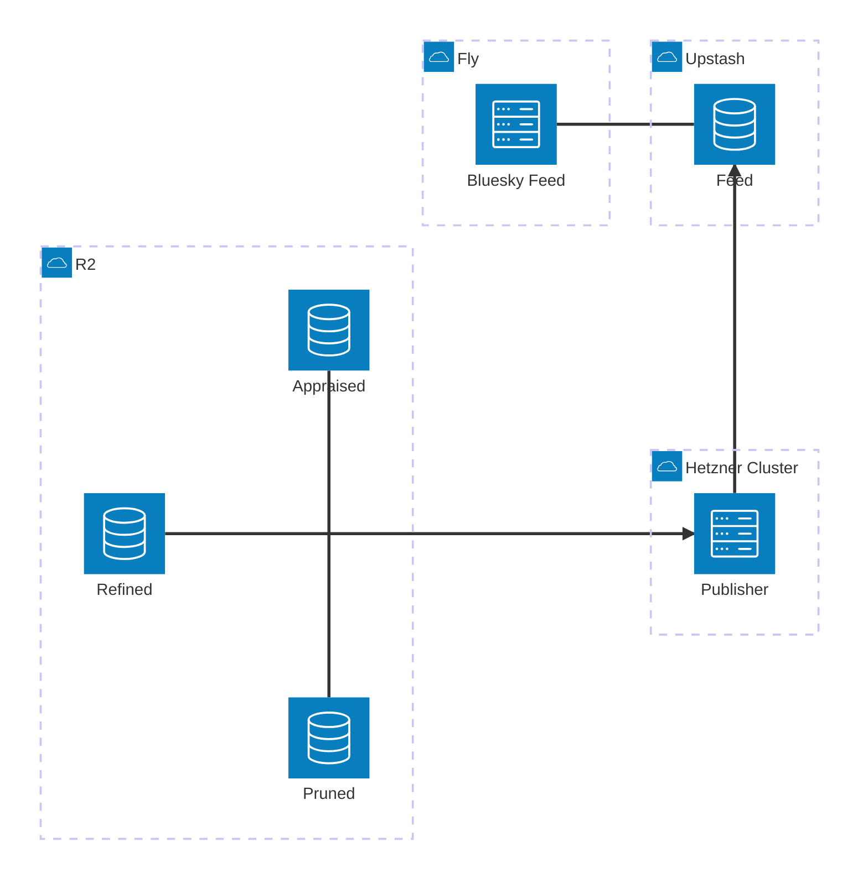

# Current Slice: Split out `skeet-feed`/`skeet-appraise`/`skeet-publish`

### Target

I want to get to the following different division of responsibilities:
* `skeet-feed`:
    * lives at `bobby-staging.houseofmoran.io`
    * handles:
        * bluesky feed
        * public website listing skeets ordered by recency and filtered by band >= MedHigh; this is a much simpler page than today's homepage (the current rich homepage moves to `skeet-appraise`)
    * bias is towards simplicity, reliability and speed (latency/cachability)
* `skeet-appraise`:
    * lives at `bobby-appraisals-staging` (the eventual MagicDNS FQDN `bobby-appraisals-staging.<tailnet>.ts.net`) within the hetzner cluster, accessible via tailscale
    * handles:
        * showing current status and editable controls (appraisals) for:
            * what is currently live as the feed (this is effectively the current `skeet-feed` homepage, moved here)
            * what has been found by the pruner and refiner for each skeet and associated images
        * manual appraisals (assigning High/MedHigh/MedLow/Low)
    * bias is towards ease-of-use and quick interactive updates
* `skeet-publish`:
    * runs in hetnzer k8s cluster like `live-refine` looking for changes to dependent tables
    * handles:
        * watching for changes in what skeets / images have been found and scored by a model as well as what has been appraised
        * determining what needs to be published as the feed; this is the canonical single place we decide this
        * this is where we apply the "ordered by recency and filtered by band >= MedHigh" from above i.e. the `skeet-feed` just blindly accepts the ordering specified by the publisher
        * publishing one redis list per **(order, limit)** choice, named `{order}-{limit}` — so the Bluesky feed is `recency-48h` and the public list (Phase 5) is `recency-7d`. `Order` is an enum (only `Recency` today = by skeet publish time; `Quality` = by score/band, later); `Limit` is a `NewType(Duration)` rendered `48h`/`7d`/`365d`. The publisher is configured with a *set* of these specs and computes/writes each generically; a reader just reads the named list it wants. Lists are named by ordering+window, deliberately **not** by visual use (no `grid`/`feed`).
        * resolving the public image URL for each published image — this is the **Bluesky CDN** URL (`https://cdn.bsky.app/img/feed_thumbnail/plain/{did}/{cid}@jpeg`), *not* our own annotated-image endpoint. The redis Feed stores `image-url:skeet-id` pairs, but whether the URL is read whole from the store, templated from a persisted blob `cid`, or derived some other way is hidden behind a trait — readers never know (see Phase 3 group A).
* `skeet-refine` stays as-is; `skeet-prune` needs one small addition — it builds the CDN URL today (`firehose.rs`) but **drops the `cid` at the classify stage**. Rather than add a store field, we carry the `cid` inside the image id itself via a new `ImageId::V3(BlueskyCid)` variant — no store-schema change, and existing code keeps treating `ImageId` opaquely. This is a prerequisite for Phase 5 rendering real images (see Phase 3 group A0).

The parts are related as follows by introducing a new redis table in upstash that sits between publisher and feed. The publisher writes `image-url:skeet-id` pairs into one named list per (order, limit) spec (resolving the image URL behind a trait). The Bluesky feed reads `recency-48h` and extracts a unique, ordered list of skeet-ids; the image URLs (Bluesky CDN, so images are served by Bluesky and never by us — which helps `skeet-feed` suspend) are used from Phase 5 onwards to render the public image list (`recency-7d`):



### Bugs / Refactors

#### Scope each Dockerfile to its crate with `-p`

##### Core, ahead of other work

* [x] audit each Dockerfile and map it to the single crate it ships, then scope both the chef cook and the final build to that crate:
    1. `Dockerfile.skeet-feed` → `-p skeet-feed` (bin `skeet-feed`)
    2. `Dockerfile.pruner` → `-p skeet-prune` (bin `pruner`)
    3. `Dockerfile.live-refine` → `-p skeet-refine` (bin `live-refine`)
    4. (no `Dockerfile.compact`/`Dockerfile.bench-firehose` exist; the other Dockerfiles are:)
        - `Dockerfile.optimise` → `-p skeet-store` (bin `optimise`)
        - `Dockerfile.cloudflare-exporter` → `-p cloudflare-exporter` (bins `sync_operations`, `sync_storage`)
        - `Dockerfile.openai-exporter` → `-p openai-exporter` (bin `sync_costs`)
* [x] in the builder stage, replace the workspace-wide cook with a scoped cook so only the crate's dependency subtree compiles:
    * `cargo chef cook --release -p <crate> --recipe-path recipe.json`
    * leave `cargo chef prepare` running over the whole workspace — the recipe is deps-only and can stay shared
* [x] replace the final `cargo build` with `cargo build --release -p <crate> --bin <bin>` so each image stops compiling sibling binaries. Kept `--bin` because several crates have many binaries (`skeet-prune` has 6, `skeet-refine` has 5); a bare `-p <crate>` would compile all of them.
* [x] **TLS / `deadpool-redis`:** the note originally said "`live-refine` / `skeet-refine`", but `skeet-refine` has no redis/`cot` dependency at all. The crate that uses `cot` + `deadpool-redis` + TLS-to-Upstash is **`skeet-feed`**, and it declares both directly, so the scoped `-p skeet-feed` cook keeps them in the same dependency subtree and the feature-unification HACK still applies. No `Cargo.toml` change was needed. *(Still needs Docker-build verification that TLS to Upstash works in the built `skeet-feed` image.)*

##### Discover / improve as we do this slice

* [ ] verify caching actually improves: with deps unchanged, touch only `<crate>/src/main.rs`, rebuild, and confirm the cook/deps layer is reused (no dependency recompile). This is the direct test of whether `-p` + chef fixes the "recompiles everything" symptom for source-only changes.
* [ ] (optional) now that each image cooks its own copy of the shared deps (`tokio`, `reqwest`, `image`, tracing/otel, `shared`), decide whether to dedup across images: BuildKit cache mounts on `target/` + the cargo registry, or `--cache-from` the previous git-hash-tagged image (ties into Q2 above on git-hash layer caching)
* [ ] apply this same `-p` pattern when adding the `skeet-appraise` and `skeet-publish` Dockerfiles (Phases 1 and 3) rather than cloning a workspace-wide build

#### Make use of git-hash?

* [ ] now that docker images are built and named based on git-hash, can we exploit that for a more exact caching of layers?

#### Deny `expect()` as well

`expect()` is probably as bad an idea in main code as `unwrap()` so deny that as well, and instead prefer explicit Result+Err, unless in tests.

* [x] similar to `unwrap_used = "deny"` and `allow-unwrap-in-tests = true` do the same for expect, and fix all related issues
    * [x] for places where we are removing possibly useful expect messages about *why* something failed, replace these instead with usage of an explicit error enum using `thiserror` (see `rust.md` for advice + see other examples of usage inside codebase)
* [x] add a note about this to @rust.md like we do for `unwrap`

#### Prefer infallible construction over `expect` for proven invariants
 
When a value is **provably in range by construction**, don't route it through a
validating constructor and `expect` the success. Give the newtype an infallible
constructor that *owns the computation*, so the invariant lives next to the type
and there is no panic path to suppress.

##### Before
 
`ConfusionMatrix` computes the ratio, then validates a value it already knows is valid:
 
```rust
pub fn precision(&self) -> Option<Precision> {
    let denom = self.true_pos + self.false_pos;
    if denom == 0 { return None; }
    let value = self.true_pos as f64 / denom as f64;
    // requires #[allow(clippy::expect_used)] + a justifying comment
    Some(Precision::new(value).expect("precision in [0, 1] by construction"))
}
```
 
##### After
 
Move the computation into the type. `Precision::new` stays as the fallible
*validating* constructor for untrusted input; `from_counts` is infallible because
`tp <= tp + fp` (preserved by the monotone `u64 as f64` cast):
 
```rust
impl Precision {
    /// precision = tp / (tp + fp); `None` iff tp + fp == 0.
    /// Always in [0, 1]: tp <= tp + fp, preserved by the f64 cast.
    pub fn from_counts(true_pos: u64, false_pos: u64) -> Option<Self> {
        let denom = true_pos + false_pos;
        (denom != 0).then(|| Self(true_pos as f64 / denom as f64))
    }
}
 
// caller becomes a one-line delegation:
pub fn precision(&self) -> Option<Precision> {
    Precision::from_counts(self.true_pos, self.false_pos)
}
```
 
For `f1`, take already-validated inputs so their `[0, 1]`-ness is guaranteed by
their *types*, leaving only one small real lemma (harmonic mean of two `[0, 1]`
values stays in `[0, 1]`):
 
```rust
impl F1 {
    pub fn harmonic(p: Precision, r: Recall) -> Self {
        let (p, r) = (f64::from(p), f64::from(r));
        let denom = p + r;
        Self(if denom == 0.0 { 0.0 } else { 2.0 * p * r / denom })
    }
}
 
// f1(): Some(F1::harmonic(self.precision()?, self.recall()?))
```
 
No `expect`, no `#[allow(clippy::expect_used)]` — the panic path is gone rather
than asserted unreachable.
 
##### The pattern
 
- Keep the **validating** constructor (`new` → `Result`/`Option`) for untrusted input.
- Add an **infallible** constructor that owns the computation guaranteeing the invariant
  (`from_counts`, `harmonic`, ...).
- Accept already-validated newtypes as inputs so the type system carries the invariant
  forward, shrinking what's left to prove.
- Result: invalid states are unconstructable at the call site, so there's no panic to
  `allow` away.

###### Tasks

* [x] Apply this advice to the mentioned code
* [x] Also check out for other instances where this pattern could apply (based on where we are currently having to apply `#[allow(clippy::expect_used)]`)

### Phases

We'll do this in phases, with a working system at each step

#### Phase 1: Split out `skeet-publish` as a library

This is not introducing a new service, but instead is factoring out the code already in `skeet-feed` which is to do with caching and generating a feed to instead live in a `skeet-publish` crate. This should live behind a trait which abstracts away as much detail as possible. The `skeet-feed` should depend only on this trait.

The trait surface should be **narrow** — `skeet-feed`'s `getFeedSkeleton` only needs an ordered, unique, visibility-filtered list of skeet-ids plus a `refreshed_at` for the `last-modified` header (image-urls get added to the surface in Phase 3/5, not now). The richer `CachedFeed` (entries + scores + appraisal maps) also moves into `skeet-publish` because the appraise homepage will consume it in Phase 2 — but it is *not* part of the `skeet-feed`-facing trait.

Transitional note: until Phase 2 moves `home`/`annotated_image` out, those handlers stay in `skeet-feed` and keep using the relocated `CachedFeed` directly. "`skeet-feed` depends only on the trait" is fully realised at the end of Phase 2; in Phase 1 it holds for the feed-generation path (`getFeedSkeleton`).

This is a pure refactor: no new service, no infra, no behaviour change. The existing `feed_endpoints` / `feed_integration` tests are the safety net — `getFeedSkeleton` output, `last-modified`, and `cache-control: no-cache` handling must stay byte-identical.

Tasks:

* [x] **Create the `skeet-publish` crate** (lib only): add to workspace `members` and a `skeet-publish = { path = "skeet-publish" }` entry in `[workspace.dependencies]`; `[lints] workspace = true`. Deps: `skeet-store`, `shared`, `chrono`, `tokio`, `tracing` (add `image` only if a moved type needs it). *(Also added `async-trait` for the `FeedSource` trait; no `image` needed.)*
* [x] **Move feed-generation policy** out of `skeet-feed` into `skeet-publish`, with its unit tests:
    * `effective_band.rs` (`image_effective_band`, `image_score_is_positive`) — this is the per-model visibility/scoring decision; per the rust rule, policy belongs in the crate that owns the decision (`skeet-publish`).
    * `visible_skeet_ids` / `visible_entries` (now in `skeet-publish/src/visibility.rs`).
* [x] **Move the cache** `feed_cache.rs` (`FeedCache`, `CachedFeed`, `spawn_background_refresh`) into `skeet-publish`, with its tests. Keep the cot middleware `FeedCacheLayer`/`FeedCacheExtractor` in the web crate(s) for now — they wrap the relocated `FeedCache`; only the cache type + refresh logic move. *(Middleware stays in `skeet-feed/src/feed_cache_middleware.rs`.)*
* [x] **Define the trait + live impl** in `skeet-publish` (`source.rs`):
    * `trait FeedSource` (async) → returns ordered, unique, visibility-filtered `Vec<SkeetId>` + `refreshed_at: Option<DateTime<Utc>>` (wrapped in `FeedSkeleton`), with a force-refresh path (to back `cache-control: no-cache`).
    * `LiveFeedSource` implementing it over `FeedCache` + `visible_entries`.
* [x] **Rewire `skeet-feed`**:
    * `get_feed_skeleton` depends only on `Arc<dyn FeedSource>` (injected via `FeedSourceLayer`/`FeedSourceExtractor`) instead of `FeedCacheExtractor`; applies `take(limit)` + last-modified exactly as today.
    * `did_document` / `describe_feed_generator` are unchanged (use `FeedConfig`).
    * `home` / `annotated_image` stay (transitional) using the relocated `CachedFeed` via `FeedCacheExtractor`.
    * Added `skeet-publish` to `skeet-feed/Cargo.toml`; deleted the now-moved local modules (`effective_band.rs`, `feed_cache.rs`, `visibility.rs`).
* [x] **Wire the bin** `skeet_feed.rs`: construct `FeedCache` → wrap in `LiveFeedSource` → inject as `Arc<dyn FeedSource>` via `FeedSourceLayer`; keep `spawn_background_refresh`.
* [x] **Verify**: `just clippy` (clean); `just test-no-docker` (442 passed, 5 skipped — feed tests pass unchanged); both `lib.rs` files well under 300 lines (`skeet-publish` 10, `skeet-feed` 22).

#### Phase 2: Split out `skeet-appraise` as a standalone website

Even though we want to ultimately make this run within the hetzner cluster and be accessible over tailscale, initially we'll introduce a new fly.io website at `bobby-appraisals-staging.houseofmoran.io`. 

This can effectively copy/clone setup we already have for `bobby-staging.houseofmoran.io` as we are largely splitting out existing code.

After Phase 1 the shared feed/cache code lives in `skeet-publish`, so both web crates depend on it cleanly (no `skeet-appraise` → `skeet-feed` dependency). `skeet-appraise` consumes the richer `CachedFeed`; `skeet-feed` keeps only the narrow `FeedSource` trait.

Route split:
* **stays in `skeet-feed`** (the Bluesky feed): `/.well-known/did.json`, `app.bsky.feed.describeFeedGenerator`, `app.bsky.feed.getFeedSkeleton`.
* **moves to `skeet-appraise`** (the appraisal UI): `/` (rich home), `/skeet/{image_id}/annotated.png`, `/admin`, `/admin/appraise/{skeet,image}`, `/auth/{login,callback,logout}`.

Tasks:

* [x] **Create the `skeet-appraise` crate** with bin `skeet-appraise` at `src/bin/skeet_appraise.rs`; added to workspace `members`. Mirrors `skeet-feed/Cargo.toml` deps + `skeet-publish`, declares `deadpool-redis` directly (the cot + deadpool-redis TLS-to-Upstash feature-unification HACK), and has its own `build.rs` (`emit_git_hash`).
* [x] **Move the appraisal/admin/auth code** out of `skeet-feed` into `skeet-appraise`, with templates and tests:
    * `home` handler + `home.html` + `HomeEntry`, and `band_options`/`BandOption` (now in `skeet-appraise/src/handlers.rs`).
    * `admin.rs` + `admin.html` / `admin_page.html` / `admin_row.html` + `appraise_skeet` / `appraise_image` (`git mv`).
    * `auth.rs` + `auth_config.rs` (`OAuthConfig` + layer/extractor) (`git mv`).
    * `annotated_image` handler (in `skeet-appraise/src/handlers.rs`).
    * `appraiser_config.rs`, `started_at.rs`, `store_middleware.rs`, `static_assets.rs` (+ `static/htmx.min.js`) (`git mv`).
    * `effective_band` consumed from `skeet-publish` (Phase 1).
* [x] **Build the `AppraiseProject` + router** (`/`, `/skeet/{image_id}/annotated.png`, `/admin`, `/admin/appraise/{skeet,image}`, `/auth/{login,callback,logout}`). Middleware: StaticFiles, Session (redis/in-memory), `FeedCacheLayer`, `Store`, `Appraiser`, `OAuthConfig`, `StartedAt`. No `FeedConfig`.
* [x] **Write the bin** `skeet_appraise.rs` cloned from `skeet_feed.rs` minus the bsky-identity args: keeps `--store-path`, `--model-path`, `--max-entries`, `--max-age-hours`, `--bind`, `--local-admin`, and the OAuth/session/redis args. Constructs `FeedCache` + `spawn_background_refresh`, injects via `FeedCacheLayer`.
* [x] **Trim `skeet-feed`**:
    * Router keeps the three feed endpoints; `/` is a minimal static placeholder until Phase 5.
    * Dropped now-unused deps (`oauth2`, `tower-sessions`, `deadpool-redis` + its TLS HACK, `image`, `urlencoding`) — clippy/tests confirm.
    * Simplified the `skeet-feed` bin Args (dropped github/session/redis/admin/local-admin) and `fly.staging.toml` process args (dropped `--use-redis`). *(Removing the OAuth/session/redis secrets from the `bobby-staging` fly app is an operational `fly secrets` step — see "external follow-ups" below.)*
* [x] **Re-home the integration tests** (public HTTP interface):
    * stays in `skeet-feed`: `did.json`, `describeFeedGenerator`, `getFeedSkeleton` (`feed_integration.rs`, feed half of `feed_endpoints.rs`).
    * moved to `skeet-appraise`: home/admin/appraise/auth (`appraise_endpoints.rs`) + `redis_session.rs` + `common/mod.rs`. The cross-cutting "appraise-then-feed-visibility" cases stay in `skeet-feed`'s `feed_endpoints.rs` but now seed appraisals via the store and assert against `getFeedSkeleton`.
* [x] **Build/deploy plumbing**:
    * `Dockerfile.skeet-appraise` (scoped `-p skeet-appraise --bin skeet-appraise`, `linux/amd64`, copies `config/refine.toml`).
    * `just/container.just`: `build-skeet-appraise` / `push-skeet-appraise`.
    * `fly.appraise-staging.toml` (app `bobby-appraisals-staging`, `OTEL_SERVICE_NAME=skeet-appraise`, `RUST_LOG=skeet_appraise=info,skeet_store=info`, health check on `/`).
    * `just/appraise.just` (imported in `justfile`): local run, `deploy_appraise_secrets` / `deploy_appraise_app`, `end_to_end_test_appraise`.
* [ ] **Secrets / OAuth / DNS / fly app** *(external — needs credentials/consoles, cannot be done from the repo)*:
    * [x] create `bobby-appraisals-staging.env` (S3, SSE-C, OTEL, github oauth, session secret, admin users, redis url).
        * some names of secrets not yet created
    * [x] build with `Dockerfile.skeet-appraise` for first time via `just push-skeet-appraise`
    * [x] `fly apps create bobby-appraisals-staging`
    * [ ] secrets import and deploy
        * [ ] `just deploy_appraise_app`
        * [ ] `just deploy_appraise_secrets`
        * this will create https://bobby-appraisals-staging.fly.dev
    * [x] create DNS in Route53 which maps `bobby-appraisals-staging.houseofmoran.io` to `bobby-appraisals-staging.fly.dev`
    * [ ] add cert for the hostname
    * [ ] New GitHub `bobby-appraisals-staging` OAuth app:
        * application name: `bobby-appraisals-staging`
        * homepage url: `https://bobby-appraisals-staging.houseofmoran.io/`
        * authorization callback url: `https://bobby-appraisals-staging.houseofmoran.io/auth/callback`
        * [x] store client id/secret in 1Password:
            * [x] `op://Dev/bobby-github-oauth-appraisals-staging-client-id/password`
            * [x] `op://Dev/bobby-github-oauth-appraisals-staging-client-secret/password`
        * [ ] try login
    * [ ] then remove the OAuth/session/redis secrets from `bobby-staging`.
* [ ] **Verify**:
    * [x] `just clippy`, `just test-no-docker` (445 passed, 5 skipped), `lib.rs` files < 300 lines (`skeet-feed` 8, `skeet-appraise` 19).
    * [ ] *(needs deploy)* `skeet-appraise`: home renders, OAuth login works, admin paging + set/clear band works, `annotated.png` served.
    * [ ] *(needs deploy)* `skeet-feed` unchanged: redeploy trimmed `bobby-staging`; `just end_to_end_test_staging` still green.

#### Phase 3: Turn `skeet-publish` into a service

This is where we introduce a new redis `feed` storage to act as the publishing destination which links `skeet-feed` and `skeet-publish`. we can do this in steps:
1. Create a new redis list in upstash — named by the `{order}-{limit}` scheme, so the Bluesky feed list is `recency-48h` (see group A) — containing `image-url:skeet-id` pairs (the publisher resolves the image URL), which represent the images which have been allowed through. `skeet-feed` reads these pairs and extracts a unique, ordered list of skeet-ids for the Bluesky feed
2. Create a new service which works like `live-refine` except it monitors and periodically recalculates the pairs (based on same logic as was in `skeet-feed` but has now been moved to this library), and then publishes this to the redis list. Deploy this to hetzner and leave running for an afternoon (verify manually that redis list makes sense).
3. Update `skeet-feed` to be configurable (via config flag) to either continue using the library implementation or reading from redis (using different implementations of same trait). Deploy this to staging with it told to use the redis input. Deploy and leave running for an afternoon and manually verify it makes sense.
4. If all good, remove implementation of trait that does live calculation and instead rely only on redis implementation.
5. Switch `skeet-feed` to be a suspendable service (see below)

##### `skeet-feed` as a suspendable Fly service: things to know

- **Eligibility:** ≤ 2 GB RAM, no swap, no GPU, machine updated since June 2024.
- **Redis connection dies on resume.** Upstash's idle timeout fires during suspension; local socket doesn't notice. Need a pool that validates before use, or retry-on-failure that reconnects + re-auths.
- **Same for any other long-lived outbound HTTP pools**
- **Every deploy invalidates the snapshot** — first request after deploy is a real cold start, not a resume. Keep the cold-start path fast (lazy-load from Redis, don't preload).
- **Tune `soft_limit`** on the HTTP service in `fly.toml` — controls how aggressively the proxy suspends. Default is too high for low-traffic staging.
- **Timers pause during suspend** and clock can lag a few seconds on resume. Use wall-clock for anything time-sensitive; don't trust `tokio::time::interval` cadence as real-time.
- **Logs and metric pushes can drop** across the suspend boundary. Don't alert on metric absence.
- **Keep health checks shallow**, or have them go through the same retry path as real requests.

##### Tasks

The five numbered steps above map onto groups A–E. Each group ends at a deployable, manually-verifiable state (run new + old alongside each other; only remove the old path once the new one is confirmed).

###### A0. Prerequisite — carry the Bluesky CID in `ImageId::V3` (land this early)

This is a self-contained, backward/forward-compatible migration that can be done ahead of (or in parallel with) the earlier phases. The roll-out order matters: **every service must be able to *parse* `v3:` ids before the pruner starts *writing* them.**

* [ ] **Add `ImageId::V3(BlueskyCid)`** in `shared`: a `BlueskyCid` newtype (FromStr/`new` + validation per the NewType rule — consider the `cid` crate rather than hand-rolling CID parsing), a `v3:`-prefixed `Display`, and matching `FromStr`/serde (the existing string-based serde then handles it transparently). Add round-trip + unknown-prefix tests. Keep `from_image` (V2) as the constructor for tests and anything content-addressing decoded pixels.
* [ ] **Audit `ImageId` usage for re-derivation** (done for this analysis, re-confirm after edits): the only **production** `ImageId::from_image` is `skeet-prune/classify.rs:152`; the refine pipeline gets ids from the store (`get_originals_by_ids`), and all other `from_image` calls are `#[cfg(test)]` fixtures. So no production path recomputes an id from pixels and compares — V3 ids flow through opaquely. Note the **dedup-semantics shift**: V2 keys on md5 of decoded pixels (collapses re-encodes of the same image), V3 keys on the blob cid (collapses only identical uploaded blobs) — acceptable, but record it.
* [ ] **Compile + deploy every service** that touches the store on this version *before* flipping the pruner, so each can read `v3:` ids. No behaviour change yet (pruner still emits V2).
* [ ] **Flip `skeet-prune` to emit V3**: thread the `cid` from `extract_skeet_candidate` (it already has it — currently only embedded in the `image_urls` strings, `firehose.rs:108`) through `SkeetCandidate` → `SkeetImage` → `classify.rs`, and build `ImageId::V3(cid)` instead of `from_image`. From here, new images are V3; old V1/V2 rows are untouched.
* [ ] **Accept the limitation**: `skeet-publish` can only resolve a CDN URL for `ImageId::V3` ids (it needs the cid). V1/V2 images have no recoverable cid, so they can't be published *with an image URL* — but the feed is recency-filtered (~48h / past week), so V1/V2 age out of the window shortly after this lands. Until then the resolver returns `None`/placeholder for them.

###### A. Define the published-list redis schema (`{order}-{limit}`, shared in `skeet-publish`) — step 1

* [ ] **The image URL is the Bluesky CDN URL, resolved behind a trait.** Target shape: `https://cdn.bsky.app/img/feed_thumbnail/plain/{did}/{cid}@jpeg` — `did` from the skeet-id, `cid` from the `ImageId::V3` (see A0). Introduce an `ImageUrlResolver` trait (in `skeet-publish`) mapping a published image → `Option<ImageUrl>`, hiding whether the value came from a V3 cid, a stored url, or elsewhere; it returns `None` for non-V3 ids. The publisher resolves at publish time so `skeet-feed` stays dumb. (Thumbnail vs fullsize template is a Phase 5 choice.)
* [ ] **Name lists by `{order}-{limit}`, with typed components.** Add an `Order` enum (`Recency` only today → by skeet publish time; designed to grow a `Quality` variant later) with `Display`/`FromStr` (`recency`), and a `Limit(Duration)` NewType (FromStr/`new` + `Display` for `48h`/`7d`/`365d` — prefer a duration-parsing dep over hand-rolling). The redis list name is `format!("{order}-{limit}")`, so the Bluesky feed list is `recency-48h`. Don't name by visual purpose (no `feed`/`grid`).
* [ ] **Decide the redis encoding before writing any redis code.** A skeet-id is an AT-URI (`at://did:plc:…/app.bsky.feed.post/rkey`) and the image-url is `https://…`, so a bare `image-url:skeet-id` string is ambiguous (both halves contain `:`). Encode each list element as a JSON object `{ "image_url": …, "skeet_id": … }` via a typed `PublishedPair` struct (serde) — not a delimiter-split string. The `image_url` stored here is the already-resolved CDN URL. Lists are always **per-image** pairs; deduplication (e.g. to unique skeet-ids for `getFeedSkeleton`) is a *read-side* concern, not part of a list's identity.
* [ ] **Own the schema in one place** in `skeet-publish`, consumed by both the publisher (write) and `skeet-feed` (read): the `Order`/`Limit` types + `{order}-{limit}` naming, the `PublishedPair` type, its serialization, and the read/write helpers. Add serialization + list-name round-trip unit tests.
* [ ] **Make replacement atomic.** The publisher recomputes each list every cycle; readers must never see a half-written list. Build into a temp key and `RENAME` over the target list (e.g. `recency-48h`) — RENAME is atomic.
* [ ] **The image-url half isn't consumed until Phase 5** — `getFeedSkeleton` only reads the skeet-id half. So get the *skeet-id* half exactly right now; the resolved `image_url` just needs to be present and plausibly correct.

###### B. Build the publisher (library + service) — step 2

* [ ] **Publisher logic in `skeet-publish`**: a `FeedPublisher` configured with a *set* of `(Order, Limit)` specs. For each spec it computes the ordered, visibility-filtered, windowed pairs via the existing Phase-1 generation logic (`LiveFeedSource` / `visible_entries`), resolves each image URL via the `ImageUrlResolver` (group A), and writes the atomic replacement to the `{order}-{limit}` list. In Phase 3 the set is just `{ recency-48h }`; Phase 5 adds `recency-7d` with no new publisher code.
* [ ] **Add a generic redis reader** in `skeet-publish` — `RedisPublishedList::new(order, limit)` → `Vec<PublishedPair>` + `refreshed_at`. Then `RedisFeedSource` (the Phase-1 `FeedSource` impl `skeet-feed` uses in group C) wraps the `recency-48h` reader and dedups to a unique, ordered list of skeet-ids.
* [ ] **Redis client / TLS**: the worker isn't a cot app, so use `deadpool-redis` (or `redis`) with rustls directly against the `rediss://` Upstash URL — independent of the cot session-store TLS HACK. `skeet-publish` declares the redis dep directly.
* [ ] **Service bin** `skeet-publish` (add `[[bin]]` to the crate): a `live-refine`-style tick loop — `tokio::time::interval`, gated on table-version changes using the same `RELEVANT_TABLES` watch as `FeedCache` (scores + skeet/image appraisals) to skip recompute when nothing moved. Args mirror `live-refine` (`--store-path`, `--model-path`, `--interval-secs`) plus `--redis-url` (env `BOBBY_REDIS_URL`) and the set of lists to publish — a repeated `--publish <order>-<limit>` (e.g. `--publish recency-48h`), parsed into `(Order, Limit)`, defaulting to `recency-48h`. No `--max-entries` (that's `skeet-feed`'s serving cap, applied on read by `getFeedSkeleton`, not a publish concern); `Limit` carries the time window. No image-host flag — the CDN template (`cdn.bsky.app`) is fixed and the resolver reads the `cid` from the `ImageId::V3` (A0) plus the `did` from the skeet-id.
* [ ] **Equivalence test** (testcontainers redis, `_docker`): publisher writes → `RedisFeedSource` reads → assert the ordered skeet-ids match what `LiveFeedSource` produces from the same store. This is the core correctness guarantee that the redis path ≡ the library path.
* [ ] **Build/deploy plumbing** (clone `live-refine`'s): `Dockerfile.skeet-publish` (`-p skeet-publish --bin skeet-publish`, platform `linux/arm64`, copy `config/refine.toml`); `build-skeet-publish`/`push-skeet-publish` in `just/container.just`; `infra/k8s/skeet-publish-deployment.yaml` (clone `live-refine-deployment.yaml`, add the redis-url env from a new `OnePasswordItem` → `bobby-upstash-redis-tcp-url`, `OTEL_SERVICE_NAME=skeet-publish`); `cluster-deploy-skeet-publish` / logs / enable / disable / rollback in `just/cluster.just`, and add it to `cluster-deploy-all` / `-restart-all` / `-enable-all` / `-disable-all`.
* [ ] **Deploy to hetzner and leave running for an afternoon**; manually inspect the `recency-48h` list and confirm it makes sense (right skeet-ids, right order, atomic — never empty/partial).

###### C. Make `skeet-feed`'s feed source configurable — step 3

* [ ] **Add a feed-source selector flag** to `skeet-feed`, keeping enablement separate from config (rust rule): e.g. `--feed-source library|redis` (or `--use-redis-feed` + `--redis-url`). It picks `LiveFeedSource` vs `RedisFeedSource` — both already implement `FeedSource`, so only the bin wiring changes; the handlers are untouched.
* [ ] **Re-add a redis client to `skeet-feed`** for the read path (it was dropped in Phase 2 with the cot sessions): `RedisFeedSource` (wrapping the `recency-48h` reader) over rustls TLS to Upstash.
* [ ] **Deploy to `bobby-staging` told to use the redis source**, leave running for an afternoon, manually verify `getFeedSkeleton` (and the live Bluesky feed) still makes sense vs the library path.

###### D. Remove the live-calc source from `skeet-feed` — step 4

* [ ] Once redis is confirmed, drop the `library` option from `skeet-feed` so it constructs only `RedisFeedSource`; remove the now-dead flag branch. **Keep `LiveFeedSource` in `skeet-publish`** — it's still used by the publisher (group B) and by `skeet-appraise`'s homepage. "Remove the live-calc implementation" means remove it as a *`skeet-feed` option*, not delete the code.
* [ ] **`skeet-feed` no longer needs the store at all**: `getFeedSkeleton` reads redis, `did.json`/`describeFeedGenerator` use `FeedConfig` only. Drop `SkeetStore`/R2/SSE-C/model deps and args from the bin, the background cache refresh, and the corresponding `fly.staging.toml` args + secrets. This shrinking of the cold-start path is the prerequisite for group E.

###### E. Make `skeet-feed` suspendable — step 5

* [ ] **Resilient redis access**: a pool that validates the connection before use, or retry-on-failure that reconnects + re-auths — Upstash's idle timeout fires during suspend and the local socket won't notice (see the suspend notes above).
* [ ] **Fast cold start**: lazy-load from redis on first request, preload nothing; every deploy invalidates the snapshot so the first post-deploy request is a real cold start.
* [ ] **`fly.staging.toml`**: `auto_stop_machines` is already `"suspend"`; tune `soft_limit` on the http service down for low-traffic staging, and route health checks through the same retry path (or keep them shallow) so a suspended-then-resumed machine doesn't fail its check.
* [ ] **Time + telemetry across the boundary**: use wall-clock for anything time-sensitive (timers pause, clock lags on resume); don't alert on metric/log absence across suspend.
* [ ] **Verify**: confirm the machine actually suspends and resumes correctly serving `getFeedSkeleton` after an idle period; `just end_to_end_test_staging` green; `just clippy` / `just test-no-docker`.

#### Phase 4: Expose `skeet-appraise` as a service inside hetzner via tailscale

Use the [Tailscale Kubernetes Operator](https://tailscale.com/kb/1236/kubernetes-operator). It spins up a proxy pod per exposed resource that joins the tailnet and forwards to the backing `Service`. No public ingress, no per-service load balancer cost.

This means we can now use tailscale to expose `skeet-appraise` running as a local k8s Service inside the cluster but still have it accessible from my phone and my laptop. As part of this we need to introduce a new type of identity of appraiser based on tailscale identity.

We can do this like in Phase 3 where we run new/old alongside each other for a little while before we delete the fly.io website for `skeet-appraise`.

At end of this we can probably do a code and infra cleanup/simplification as we should no-longer need the github app / redis auth / oauth login stuff.

##### Use `Ingress`, not `Service`, for identity

Of the operator's exposure modes, only [`Ingress`](https://tailscale.com/kb/1439/kubernetes-operator-cluster-ingress) injects Tailscale identity headers, which is the whole point here. Every request gets:

* `Tailscale-User-Login` — caller's login (e.g. `mike@example.com`)
* `Tailscale-User-Name` — display name
* `Tailscale-User-Profile-Pic` — profile image URL

The proxy strips incoming versions of these headers before forwarding, so they can't be spoofed from the tailnet. Anything else in-cluster reaching the backend `Service` directly could spoof them, so add a `NetworkPolicy` restricting the `Service` to only the Tailscale proxy pod.

[tailscale/tailscale#15657](https://github.com/tailscale/tailscale/issues/15657) tracks identity headers for bare `Service` resources but is open and unmoving — `Ingress` is the only option today.

##### Constraints of `Ingress` mode

* HTTPS-only, port 443 only; certs auto-provisioned from Let's Encrypt.
* Requires HTTPS and MagicDNS enabled on the tailnet ([docs](https://tailscale.com/kb/1153/enabling-https)).
* Reachable only by the full MagicDNS FQDN (e.g. `bobby-appraisals-staging.<tailnet>.ts.net`) so the cert matches.
* First connection after deploy can be slow while the cert is provisioned.

##### Prerequisite

OAuth client created in the Tailscale admin console for the operator — see the operator [setup section](https://tailscale.com/kb/1236/kubernetes-operator#setup). Needs **`Devices Core` + `Auth Keys` + `Services`** write scopes and the `tag:k8s-operator` tag (which must already exist in the tailnet policy file). MagicDNS + HTTPS must be enabled on the tailnet for `Ingress` mode to provision certs.

##### Tasks

Spike first, then groups A–E. As in Phase 3, run the new (hetzner + tailscale) deployment alongside the old (fly + GitHub OAuth) one, verify, then cut over and clean up. Local dev keeps `--local-admin` throughout.

###### Spike (do this first): prove the Tailscale operator + `Ingress` path with a dummy service

This is the first time using Tailscale this way, so isolate the Tailscale dependency *before* touching `skeet-appraise`. Stand up the whole operator → `Ingress` → identity-header path with a throwaway workload and nothing of ours on the line. The operator and tailnet config that this sets up are **kept** and reused by group C; only the dummy workload is torn down.

* [ ] **Install the operator + enable the tailnet features** (the riskiest, least-familiar bits). Order matters — do these in sequence:
    1. **Add the operator tags to the tailnet policy file** *before* creating the OAuth client (the client must be tagged with one): `"tagOwners": { "tag:k8s-operator": [], "tag:k8s": ["tag:k8s-operator"] }`.
    2. **Create the operator OAuth client** in the admin console (see Phase 4 Prerequisite) with **`Devices Core` + `Auth Keys` + `Services`** write scopes (the `Services` scope is newer and now required), tagged `tag:k8s-operator`; store id/secret in 1Password.
    3. **Enable MagicDNS + HTTPS** on the tailnet.
    4. **`helm install` the operator** (add a `cluster-install-tailscale-operator` recipe alongside the other addon installers in `just/cluster.just`, feeding `oauth.clientId`/`oauth.clientSecret` via inline `op read` like `cluster-ghcr-secret-install` does).
* [ ] **Deploy a trivial header-echo service** — no code/build of ours: a stock multi-arch image like `traefik/whoami` (it echoes request headers, which is exactly what we need to *see* the injected identity). Give it a `Deployment` + `Service` and a tailscale-`ingressClassName` `Ingress` named e.g. `bobby-ts-spike`. Use the current Ingress shape — `spec.ingressClassName: tailscale` + `spec.defaultBackend.service` + `spec.tls.hosts` (only the **first label** of the host is used → `<label>.<tailnet>.ts.net`), *not* `rules`/`host`. **Do not set `tailscale.com/funnel: "true"`** — Funnel makes the service public *and* drops the identity headers this whole phase depends on; we want tailnet-only Serve traffic.
* [ ] **Verify the unknowns, in order:**
    * the `Ingress` provisions a Let's Encrypt cert and the service appears at `bobby-ts-spike.<tailnet>.ts.net` (first hit may be slow while the cert provisions);
    * it's reachable from **phone and laptop** over the tailnet (and *not* publicly);
    * the echo shows `Tailscale-User-Login` / `-Name` / `-Profile-Pic` populated with your identity — this is the make-or-break proof for group A;
    * a request that *sends its own* `Tailscale-User-Login` still comes back with the proxy's value (inbound copies are stripped), confirming the header can be trusted behind the ingress.
* [ ] **Prove the `NetworkPolicy`** (run it once here — group C depends on it, and NetworkPolicy enforcement is worth confirming on this hetzner-k3s cluster): restrict the dummy `Service` to the proxy pod and confirm a direct in-cluster curl is blocked while the ingress path still works — this de-risks the anti-spoofing control before group C relies on it.
* [ ] **Tear down the dummy workload** (Deployment/Service/Ingress); keep the operator, OAuth client, and MagicDNS/HTTPS settings.

###### A. Tailscale-based appraiser identity

* [ ] **Add `Appraiser::Tailscale { login }`** in `shared/src/appraiser.rs`: extend the `provider:identifier` parse/display (`tailscale:mike@example.com`), a validated `new_tailscale` constructor, and round-trip + unknown-provider tests. Mirrors the existing `GitHub`/`LocalAdmin` variants.
* [ ] **Add a header-based extractor path** for `skeet-appraise`: read `Tailscale-User-Login` from the request head and produce `Appraiser::Tailscale` (optionally surface `Tailscale-User-Name` / `-Profile-Pic` for display). This is a third source alongside the existing extensions (local-admin) and session (OAuth) paths in `AppraiserExtractor`.
* [ ] **Gate header-trust on an explicit auth-mode flag**, not header presence (the header is only trustworthy behind the Tailscale ingress; on the fly deployment it could be spoofed). Add `--auth-mode tailscale|github|local-admin` (enablement separate from config, per the rust rule). Only `tailscale` mode reads the identity headers; never auto-detect from header presence.
* [ ] **Authorization = tailnet ACLs + a required login allowlist** (decided — the allowlist is *not* optional). Tailnet ACLs gate who can reach the service; on top of that, an explicit allowlist of permitted `Tailscale-User-Login` values (the analogue of `BOBBY_ADMIN_USERS`, now holding tailscale logins/emails instead of GitHub usernames) gates who is accepted as an appraiser. Defense in depth: a tailnet identity that can reach the service but isn't on the allowlist gets `403`. The allowlist is required config in `tailscale` mode (startup fails if unset).
* [ ] **Simplify the admin guard for tailscale mode**: every request through the ingress is already identified, so there's no login/logout redirect — a missing identity header is a `403` (shouldn't happen behind the proxy). The public/admin (`is_admin`) split on the homepage collapses, since `skeet-appraise` is now a private tool; decide whether to drop it.
* [ ] **Test**: with a `Tailscale-User-Login` header in `tailscale` mode the extractor yields `Appraiser::Tailscale` and an appraisal round-trips; without it the request is denied; `github`/`local-admin` modes are unaffected.

###### B. Deploy `skeet-appraise` into the hetzner cluster

* [ ] **Build an `arm64` image** — the cluster is ARM (like `pruner`/`live-refine`), but `Dockerfile.skeet-appraise` ships `linux/amd64` for fly. During the parallel run both arches are live, so build multi-arch (`--platform linux/amd64,linux/arm64`) or add an arm64 tag; drop amd64 once fly is gone (group E).
* [ ] **k8s Deployment + Service** (`infra/k8s/skeet-appraise-deployment.yaml`): unlike the `live-refine` worker this is a long-running HTTP server, so it needs a `Service` (port 8080) fronting the Deployment. Args: `--store-path`, `--model-path`, feed-shape params, `--auth-mode tailscale`, `--bind 0.0.0.0:8080`. Env: R2 + SSE-C + OTEL only — **no GitHub/session/redis**: tailscale mode has no OAuth and no sessions, so the redis-for-sessions dependency drops out here.
* [ ] **`just/cluster.just` recipes**: `cluster-deploy-skeet-appraise`, logs, enable/disable, rollback, and add to the `cluster-*-all` aggregates (mirroring `live-refine`). Reuse the existing R2/SSE-C/OTEL `OnePasswordItem`s — no new secrets needed for the app itself.

###### C. Expose it over tailscale via the operator (`Ingress`)

The operator, OAuth client, and MagicDNS/HTTPS are already stood up and proven by the Spike — this group just applies the same, now-known-good pattern to the real service.

* [ ] **`Ingress` (not `Service`) for identity** — only `Ingress` mode injects the `Tailscale-User-*` headers (see the "Use `Ingress`" notes above). Add an `Ingress` with the tailscale `ingressClassName` for `skeet-appraise`; it provisions the cert and publishes at `bobby-appraisals-staging.<tailnet>.ts.net` (HTTPS/443 only) — exactly the path validated by the spike.
* [ ] **`NetworkPolicy` to prevent header spoofing** — the proxy strips inbound `Tailscale-User-*` headers, but anything in-cluster hitting the backend `Service` directly could forge them. Restrict the `Service` to accept traffic only from the Tailscale proxy pod (same control proven in the spike).

###### D. Parallel run + verify

* [ ] Reach `bobby-appraisals-staging.<tailnet>.ts.net` from phone and laptop over the tailnet; confirm the identity headers yield the right `Appraiser::Tailscale`, and that appraisals set/clear and the homepage + admin paging all work end-to-end (first connection may be slow while the cert provisions).
* [ ] Leave it running alongside the fly site for a while; sanity-check that appraisals made via either reach the same store and behave identically.

###### E. Cut over + cleanup

* [ ] **Decommission the fly site**: `fly apps destroy bobby-appraisals-staging`; remove `fly.appraise-staging.toml`, the `deploy_appraise_*` fly recipes, and the GitHub-OAuth / session / redis secrets for that app.
* [ ] **Rip out the now-dead auth stack** from `skeet-appraise` (the cleanup the phase intro calls for): delete `auth.rs`, `auth_config.rs` (`OAuthConfig`), the `/auth/{login,callback,logout}` routes, the cot session middleware + `deadpool-redis` dep, and the `BOBBY_GITHUB_*` / `BOBBY_SESSION_SECRET` / sessions-redis config + 1Password items. Drop the `github` arm of `--auth-mode` (leaving `tailscale` + `local-admin`). Remove the GitHub OAuth app.
* [ ] **Verify post-cleanup**: `just clippy`, `just test-no-docker`; `skeet-appraise` still builds without the oauth/session deps; the relocated integration tests (now tailscale-header based) pass; drop the amd64 image build.
* [ ] Update docs (`docs/architecture.md`, any auth notes) to reflect tailscale identity replacing GitHub OAuth.

#### Phase 5: turn `skeet-feed` homepage into a simple-but-nice list of images

What I am envisaging here is a pinterest-style layout using css-grid. This should show all images seens in past week, and a click on each goes to the skeet. This may involve extending the publisher to publish a larger list of all images seen in past week (not just past couple of days that show in feed).

This should be as server-rendered as possible, with associated cache headers on images and similar to maximise cache-ability.

This reuses the Phase 3 machinery wholesale — `PublishedPair`, the atomic-replace redis schema, the `ImageUrlResolver`, the publisher tick loop. After Phase 3 `skeet-feed` is **storeless and suspendable** and images are served by the **Bluesky CDN** (`image_url` in each pair), so `skeet-feed` never serves image bytes and the page is cheap to render and cache.

Decisions baked in (flagged where a real choice exists):
* **A second list under the same `(order, limit)` scheme.** The Bluesky feed is `recency-48h`; the public list is a wider `recency-7d` — same mechanism, just a longer window, so it's a config entry in the publisher's spec set, not bespoke code. Published lists are always **per-image** `PublishedPair`s; `getFeedSkeleton` dedups to unique skeet-ids on read, while the public page renders every image. So per-image-vs-per-skeet is a *read-side* choice, not part of list identity.
* **Still filtered by `band >= MedHigh`** — the public page applies the same visibility policy as the feed (Target), just over a week. *(Publisher policy decision: confirm we don't want Low/MedLow shown publicly.)*
* **Thumbnails, click-through to the skeet.** Cards use the `feed_thumbnail` CDN URL already in the pair; clicking goes to `https://bsky.app/profile/{did}/post/{rkey}` (derived from the skeet-id), not a fullsize image.

###### A. Publisher: publish the `recency-7d` list

* [ ] **Add `recency-7d` to the publisher's spec set** — `Order::Recency` + `Limit(7d)`. This is a config entry, not new code: the generic `(Order, Limit)` loop from Phase 3 B already computes, windows, and atomically writes each list. Pass it via the existing `--publish recency-48h --publish recency-7d`.
* [ ] **Reuse the schema + resolver** — `PublishedPair`, the naming, and `ImageUrlResolver` are unchanged; only the `Limit` window differs.
* [ ] **Confirm a wider window is covered by the round-trip test** (the Phase 3 test is already generic over `(Order, Limit)`): publisher writes `recency-7d` → reader decodes → expected images present in recency order.

###### B. `skeet-feed`: read + server-render the list at `/`

* [ ] **Read `recency-7d`** via the generic `RedisPublishedList::new(Order::Recency, Limit(7d))` reader from Phase 3 B (no new reader type) → `Vec<PublishedPair>` + `refreshed_at`, reusing the same resilient TLS redis pool. Keep the cold-start path lazy (read on first request) so suspend/resume stays fast.
* [ ] **Replace `/`'s placeholder** (the Phase-2 stub) with the page handler: server-render a JS-free css-grid of `<a href="{bsky_url}"></a>` cards in list order. Inline the `<style>` (single request, nothing to cache-bust). `did.json` / `describeFeedGenerator` / `getFeedSkeleton` are untouched.
* [ ] **Layout**: start with **uniform aspect-ratio tiles** (`aspect-ratio` + `object-fit: cover`) — zero layout shift, no image dimensions needed, true css-grid per the brief. *(If we later want real variable-height masonry, that needs either CSS `column-count` or carrying width/height in `PublishedPair` — defer unless wanted.)*

###### C. Caching + polish

* [ ] **HTML caching**: set `Last-Modified` from the grid's `refreshed_at` and honour `If-Modified-Since` → `304` (same pattern as `getFeedSkeleton`), plus a short `Cache-Control: public, max-age=…`. Low-traffic + suspendable, so a small max-age + revalidation is the right trade.
* [ ] **Images need no work from us** — they're `cdn.bsky.app` URLs with Bluesky's own long-lived caching; `loading="lazy"` + explicit tile sizing (via `aspect-ratio`) avoids layout shift. Our caching responsibility is just the HTML (and the inlined CSS rides with it).
* [ ] **Empty / cold states**: render a tidy empty grid when the `recency-7d` list is missing/empty (e.g. right after a deploy before the publisher's first write), not an error.

###### D. Verify

* [ ] **Integration test** (testcontainers redis, `_docker`): seed a `recency-7d` list, `GET /`, assert cards render in order with the right CDN `src` and `bsky.app` hrefs; `Last-Modified` present; `If-Modified-Since` returns `304`.
* [ ] **Manual**: deploy publisher + `skeet-feed`, confirm the public grid shows a week of `band >= MedHigh` images, clicks land on the right skeets, and the page still serves correctly through a suspend/resume cycle.
* [ ] `just clippy`, `just test-no-docker`, `just end_to_end_test_staging`.
