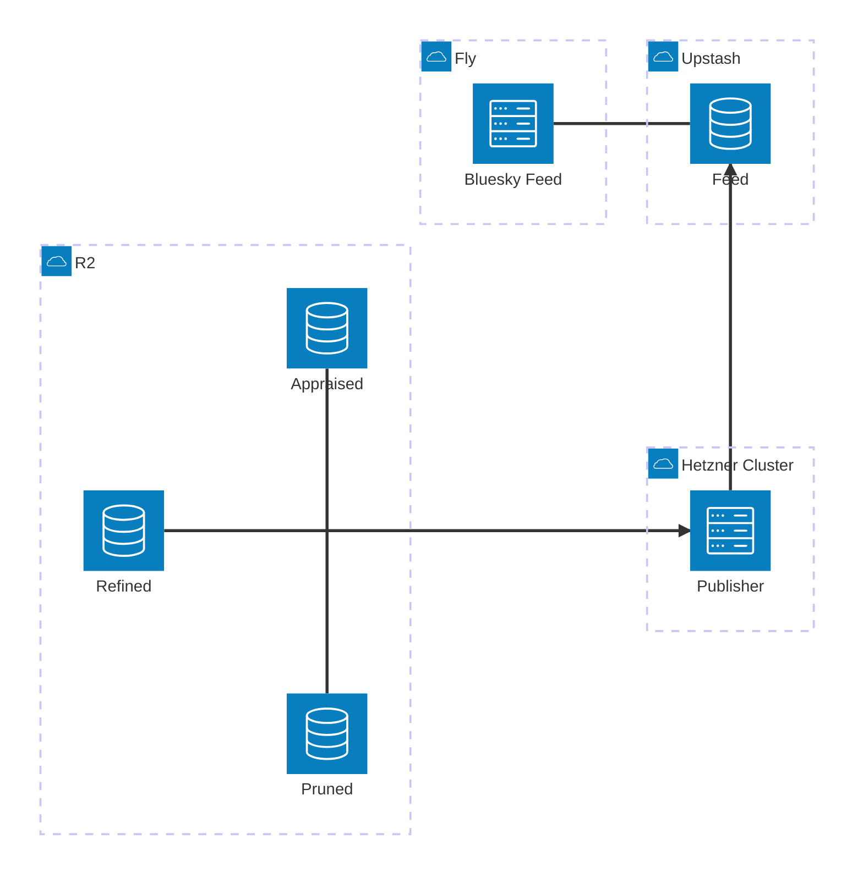

# Next Slices

## Slice: Split out `skeet-feed`/`skeet-appraise`/`skeet-publish`

### Target

I want to get to the following different division of responsibilities:
* `skeet-feed`:
    * lives at `bobby-staging.houseofmoran.io`
    * handles:
        * bluesky feed
        * public website listing skeets ordered by recency and filtered by band >= MedHigh; this is a much simpler page than today's homepage (the current rich homepage moves to `skeet-appraise`)
    * bias is towards simplicity, reliability and speed (latency/cachability)
* `skeet-appraise`:
    * lives at `bobby-appraisals-staging` (the eventual MagicDNS FQDN `bobby-appraisals-staging.<tailnet>.ts.net`) within the hetzner cluster, accessible via tailscale
    * handles:
        * showing current status and editable controls (appraisals) for:
            * what is currently live as the feed (this is effectively the current `skeet-feed` homepage, moved here)
            * what has been found by the pruner and refiner for each skeet and associated images
        * manual appraisals (assigning High/MedHigh/MedLow/Low)
    * bias is towards ease-of-use and quick interactive updates
* `skeet-publish`:
    * runs in hetnzer k8s cluster like `live-refine` looking for changes to dependent tables
    * handles:
        * watching for changes in what skeets / images have been found and scored by a model as well as what has been appraised
        * determining what needs to be published as the feed; this is the canonical single place we decide this
        * this is where we apply the "ordered by recency and filtered by band >= MedHigh" from above i.e. the `skeet-feed` just blindly accepts the ordering specified by the publisher
        * deriving the image URL for each published image (the redis Feed stores `image-url:skeet-id` pairs)
* `skeet-refine` / `skeet-prune` stay as-is

The parts are related as follows by introducing a new redis table in upstash that sits between publisher and feed. The publisher writes `image-url:skeet-id` pairs to this table (it derives the image URL). The Bluesky feed reads the pairs and extracts a unique, ordered list of skeet-ids; the image URLs are used (from Phase 5 onwards) to render the public image grid:

### Bugs / Refactors

#### Docker / chef broken?

* [ ] it seems that docker rust chef based caching is no-longer working i.e. even if library dependencies haven't changed, it still recompiles everything
    1. what's up?
    2. now that docker images are built and named based on git-hash, can we exploit that for a more exact caching of layers?

### Phases

We'll do this in phases, with a working system at each step

#### Phase 1: Split out `skeet-appraise` as a standalone website

Even though we want to ultimately make this run within the hetzner cluster and be accessible over tailscale, initially we'll introduce a new fly.io website at `bobby-appraisals-staging.houseofmoran.io`. 

This can effectively copy/clone setup we already have for `bobby-staging.houseofmoran.io` as we are largely splitting out existing code.

Tasks:
...

#### Phase 2: Split out `skeet-publish` as a library

This is not introducing a new service, but instead is factoring out the code already in `skeet-feed` which is to do with caching and generating a feed to instead live in `skeet-publish` crate. This should live behind a trait which abstracts away as much detail as possible. The `skeet-feed` should depend only on this trait.

Tasks:
...

#### Phase 3: Turn `skeet-publish` into a service

This is where we introduce a new redis `feed` storage to act as the publishing destination which links `skeet-feed` and `skeet-publish`. we can do this in steps:
1. Create a new redis list in upstash called `feeds` which will contain a list of `image-url:skeet-id` pairs (the publisher derives the image URL), which represent the images which have been allowed through. `skeet-feed` reads these pairs and extracts a unique, ordered list of skeet-ids for the Bluesky feed
2. Create a new service which works like `live-refine` except it monitors and periodically recalculates the pairs (based on same logic as was in `skeet-feed` but has now been moved to this library), and then publishes this to the redis list. Deploy this to hetzner and leave running for an afternoon (verify manually that redis list makes sense).
3. Update `skeet-feed` to be configurable (via config flag) to either continue using the library implementation or reading from redis (using different implementations of same trait). Deploy this to staging with it told to use the redis input. Deploy and leave running for an afternoon and manually verify it makes sense.
4. If all good, remove implementation of trait that does live calculation and instead rely only on redis implementation.
5. Switch `skeet-feed` to be a suspendable service (see below)

##### `skeet-feed` as a suspendable Fly service: things to know

- **Eligibility:** ≤ 2 GB RAM, no swap, no GPU, machine updated since June 2024.
- **Redis connection dies on resume.** Upstash's idle timeout fires during suspension; local socket doesn't notice. Need a pool that validates before use, or retry-on-failure that reconnects + re-auths.
- **Same for any other long-lived outbound HTTP pools**
- **Every deploy invalidates the snapshot** — first request after deploy is a real cold start, not a resume. Keep the cold-start path fast (lazy-load from Redis, don't preload).
- **Tune `soft_limit`** on the HTTP service in `fly.toml` — controls how aggressively the proxy suspends. Default is too high for low-traffic staging.
- **Timers pause during suspend** and clock can lag a few seconds on resume. Use wall-clock for anything time-sensitive; don't trust `tokio::time::interval` cadence as real-time.
- **Logs and metric pushes can drop** across the suspend boundary. Don't alert on metric absence.
- **Keep health checks shallow**, or have them go through the same retry path as real requests.

Tasks:
...

#### Phase 4: Expose `skeet-appraise` as a service inside hetzner via tailscale

Use the [Tailscale Kubernetes Operator](https://tailscale.com/kb/1236/kubernetes-operator). It spins up a proxy pod per exposed resource that joins the tailnet and forwards to the backing `Service`. No public ingress, no per-service load balancer cost.

This means we can now use tailscale to expose `skeet-appraise` running as a local k8s Service inside the cluster but still have it accessible from my phone and my laptop. As part of this we need to introduce a new type of identity of appraiser based on tailscale identity.

We can do this like in Phase 3 where we run new/old alongside each other for a little while before we delete the fly.io website for `skeet-appraise`.

At end of this we can probably do a code and infra cleanup/simplification as we should no-longer need the github app / redis auth / oauth login stuff.

##### Use `Ingress`, not `Service`, for identity

Of the operator's exposure modes, only [`Ingress`](https://tailscale.com/kb/1439/kubernetes-operator-cluster-ingress) injects Tailscale identity headers, which is the whole point here. Every request gets:

* `Tailscale-User-Login` — caller's login (e.g. `mike@example.com`)
* `Tailscale-User-Name` — display name
* `Tailscale-User-Profile-Pic` — profile image URL

The proxy strips incoming versions of these headers before forwarding, so they can't be spoofed from the tailnet. Anything else in-cluster reaching the backend `Service` directly could spoof them, so add a `NetworkPolicy` restricting the `Service` to only the Tailscale proxy pod.

[tailscale/tailscale#15657](https://github.com/tailscale/tailscale/issues/15657) tracks identity headers for bare `Service` resources but is open and unmoving — `Ingress` is the only option today.

##### Constraints of `Ingress` mode

* HTTPS-only, port 443 only; certs auto-provisioned from Let's Encrypt.
* Requires HTTPS and MagicDNS enabled on the tailnet ([docs](https://tailscale.com/kb/1153/enabling-https)).
* Reachable only by the full MagicDNS FQDN (e.g. `bobby-appraisals-staging.<tailnet>.ts.net`) so the cert matches.
* First connection after deploy can be slow while the cert is provisioned.

##### Prerequisite

OAuth client created in the Tailscale admin console for the operator — see the operator [setup section](https://tailscale.com/kb/1236/kubernetes-operator#setup).

##### Tasks
...

#### Phase 5: turn `skeet-feed` homepage into a simple-but-nice list of images

What I am envisaging here is a pinterest-style layout using css-grid. This should show all images seens in past week, and a click on each goes to the skeet. This may involve extending the publisher to publish a larger list of all images seen in past week (not just past couple of days that show in feed).

This should be as server-rendered as possible, with associated cache headers on images and similar to maximise cache-ability.

Tasks:
...

## Slice: improving prune and refine quality

### Target: prune

I'm still seeing some examples (e.g. examples/v2:de210c2970ed76cf79c27d8cd557214a.png) where the text-detection should ideally be excluding them. I think we can exclude these images by looking at overlap between the text bounding boxes and the 3x3 grid of zones and looking at some features:
1. what %-age of a Zone is taken up by text-boxes (unioned area)?
2. how many Zones have at least some %-age of text-box area?

We can then exclude any images that have > threshold %-age in any Zone, and > number threshold of Zones.

### Target: refine

...

### Tasks

...

## Slice: reducing unintentional bias

### Target

The current skin-detection method in `lib.rs` (Kovac/Peer/Solina 2003 RGB rules + a YCbCr box) is biased toward lighter skin tones. Replace it with a method that performs more fairly across the Fitzpatrick scale, and add tests that would catch this kind of regression in future.

### Tasks

#### Document and demonstrate the current bias
- [ ] Write up the specific lines in `is_skin_pixel` that exclude darker skin:
    - [ ] `r <= 95.0` reject — eliminates much dark brown skin outright
    - [ ] `g <= 40.0` / `b <= 20.0` rejects — fail in shadow and on very dark skin
    - [ ] `(r - g).abs() <= 15.0` reject — absolute R−G gap shrinks at lower intensities even when the ratio is preserved
    - [ ] `max - min <= 15.0` reject — same low-intensity compression problem
    - [ ] note that the YCbCr box is the least-biased part but is ANDed with the RGB gate, so the RGB rules dominate failures
- [ ] Add failing unit tests with known dark-skin RGB samples (e.g. `(80, 50, 35)`, `(60, 40, 30)`, `(110, 75, 55)`) asserting they should be classified as skin — these should fail against the current implementation and pass against the replacement
- [ ] Assemble a small evaluation set of face images spanning Fitzpatrick I–VI and measure per-bucket true-positive rate before and after the change

#### Pick a less-biased method
- [ ] Evaluate options in roughly increasing order of effort:
    - [ ] **CbCr-only elliptical region** (Hsu, Abdel-Mottaleb & Jain, 2002) — drop the RGB gate entirely, fit an ellipse in CbCr space rather than an axis-aligned box. Small code change, big fairness improvement.
    - [ ] **HSV or normalised-rgb thresholds** — hue ≈ [0°, 50°] with moderate saturation and *any* value; removes the luminance dependency that hurts dark skin
    - [ ] **Jones & Rehg statistical skin model** (1999) — Bayesian histogram trained on a large diverse pixel set, runtime is a 3D lookup table, still the standard classical baseline
    - [ ] **Modern ML model trained on a diverse dataset** — anything evaluated on Fitzpatrick 17k or trained on FSD/ECU/Pratheepan; highest accuracy, adds a dependency

#### Rust ecosystem options
- [ ] **Pure-Rust / classical (no new heavy deps).** There is no dedicated "less-biased skin detector" crate on crates.io — closest neighbours are face-detection crates, not skin segmentation. So this path is hand-rolled on top of the existing `image` crate:
    - [ ] Implement a CbCr-ellipse or HSV test directly in `lib.rs`
    - [ ] Optionally fit a Jones-and-Rehg histogram offline against the [UCI Skin Segmentation dataset](https://archive.ics.uci.edu/ml/datasets/skin+segmentation) (built from face images "of diversity of age, gender, and race") and ship the resulting lookup table as a `.bin` in the repo
- [ ] **ML model via ONNX.** The standard route for running pretrained vision models from Rust is the [`ort`](https://crates.io/crates/ort) crate (ONNX Runtime bindings). [`rust-faces`](https://crates.io/crates/rust-faces) is a good template for how to wire an ONNX model into a Rust API similar to our `detect_skin` signature.
- [ ] **Candidate model:** [samhaswon/skin_segmentation](https://github.com/samhaswon/skin_segmentation) on GitHub — a benchmark/training repo with ONNX exports of several skin-segmentation models (BiRefNet, U²-Net variants, etc.). The author explicitly built the training set "to maximize diversity of scene, lighting, and skin appearance" with augmentations designed so the model isn't dependent on lighting or camera settings. Caveat: the heaviest BiRefNet variant uses ~40 GB RAM through onnxruntime, so pick one of the smaller CNN models.
- [ ] **Background reading** for evaluation methodology and fairness framing:
    - [ ] [Fitzpatrick 17k](https://github.com/mattgroh/fitzpatrick17k) (Groh et al., 2021) — standard fairness benchmark
    - [ ] [Bencevic et al. (2024)](https://www.sciencedirect.com/science/article/pii/S0169260724000403) — quantifies the same bias pattern across U-Net-based skin segmentation models

#### Recommended path
- [ ] **Step 1 — cheap win.** Replace the RGB+CbCr-box rules with either a CbCr ellipse or a Jones-and-Rehg histogram trained on the UCI dataset. Pure Rust, no new heavy deps, almost certainly closes most of the gap. Add the dark-skin unit tests above so the improvement is visible.
- [ ] **Step 2 — only if step 1 isn't good enough.** Add `ort` and load one of the smaller models from samhaswon/skin_segmentation behind an optional feature flag (`features = ["ml"]`), keeping the classical path as the default so the binary stays small.

#### Guardrails
- [ ] Keep the per-Fitzpatrick-bucket eval as a checked-in test or bench so future changes can't silently regress fairness
- [ ] Update the doc-comment on `detect_skin` to honestly describe what the method does and its known limitations

## Slice: replay-based regression testing

### Target

Catch performance and cost regressions before they reach production. The motivating incident is the 26 Apr R2 Class A blowup (see `docs/current-slice.md`): a one-line change in `bc59e99` 10×'d the pruner's LIST rate against R2 and was only caught after deploy by reading Grafana graphs. The shape we want: capture real input traffic for a few minutes, replay the pipeline against a local backend, snapshot the resulting OTel counters, fail the test when any counter moves outside an expected band.

This is **not** deterministic simulation testing in the FoundationDB/TigerBeetle sense — no fake runtime, no concurrency exploration, no fault injection. Just: capture → replay → snapshot → diff.

What it catches:
* R2 op-count regressions (the 26 Apr incident)
* Queue-depth regressions (assert p99 of the depth gauge stays low)
* Throughput cliffs (events processed per simulated minute)
* Anything else expressible as an OTel metric

Out of scope:
* LLM cost regressions
* Concurrency bugs that would need a real DST framework
* Behaviours that only emerge under load longer than the fixture

### Tasks

#### Phase 1: replay infrastructure for pruner

* [ ] make the firehose source pluggable: `firehose::connect` currently returns a concrete `JetstreamReceiver`. Refactor the pipeline to accept any `Stream<Item = JetstreamEvent>` so a JSONL-backed source can drop in
* [ ] add a `capture` CLI that, for a given `--duration`:
    * records firehose events to `tests/fixtures/<name>/firehose.jsonl`
    * snapshots the live R2 store to a tarball at `tests/fixtures/<name>/store.tar`
    * records image HTTP GETs to `tests/fixtures/<name>/images/`
    * keep fixtures small enough to commit; if they grow past a few MB, move to git-lfs or an R2 fixtures bucket
* [ ] write a `replay_pruner` integration test that:
    * extracts the store tarball into a tempdir
    * opens the store via `file://` (existing `StoreArgs::open_store` path) wrapped in `R2MetricsWrapper` — the wrapper produces cost-equivalent counts against local disk
    * serves recorded image responses via [`wiremock`](https://github.com/LukeMathWalker/wiremock-rs)
    * drives the JSONL stream into the pluggable firehose source
    * runs until the stream ends, then `force_flush()`s the OTel meter and serialises all counters/gauges (the `InMemoryMetricExporter` pattern in `store_metrics.rs` already shows the shape)
* [ ] assert via a checked-in `expected-metrics.json` with explicit per-counter ranges (e.g. `r2.operations{operation="list"}: 60..120`). Prefer this over `insta`-style auto-blessing — clearer failure messages, no risk of someone blessing a 10× regression by reflex
* [ ] wire into `just test` so it runs in CI

#### Phase 2: extend to live-refine

* [ ] record OpenAI API responses keyed by request hash for the fixture window (wiremock or [`rvcr`](https://github.com/ChorusOne/rvcr))
* [ ] write `replay_live_refine` mirroring the pruner test, asserting both R2 ops and OpenAI request counts

#### Maintenance

* [ ] document how and when to refresh fixtures and the expected-metrics baseline — only when fixtures no longer represent production (e.g. firehose schema change, store schema change), not on every behaviour change
