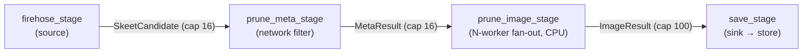

# `skeet-prune` — stream-processing architecture review

A deep read of the crate's runtime shape (~1.1k LOC of non-bin source across 12
modules + 6 bins), held up against how streaming pipelines are built in general
and how they're idiomatically built in async Rust. This is **not** an action
checklist — it's observations grounded in external practice, ordered by impact,
for you to weigh against your own opinions. The companion task decomposition
(Group 0 in `docs/current-slice.md`) cherry-picks what's worth doing now; plenty
here is deliberately left as "noted, not pursued".

Versions pinned while writing: `tokio 1` (`features=["full"]`), `jetstream-oxide
0.1`, `futures` via the workspace. Findings cite `file:line` from the worktree at
review time. The two firehose-robustness defects (cursor, backoff) are already
written up in the slice intro and owned by Groups 2/3 — this review covers
*everything else* and only references them where the architecture forces it.

---

## TL;DR — the shape of it

`skeet-prune` is a textbook **staged pipeline** (pipes-and-filters / SEDA): a
source, three transform stages, and a sink, each its own `tokio` task, wired
together by **bounded `mpsc` channels** that carry backpressure end-to-end. The
topology:



This is a *good* fit for the job and the architecture doc's "cheap checks inline
with the firehose, sample if you can't keep up" mandate. Backpressure is real
(bounded channels, `send().await` blocks), the fan-out is where it belongs (the
expensive ML stage), the sink is idempotent (content-hash keyed), and the inline
extraction at the source (`extract_skeet_candidate`) is exactly the "simple parts
inline" the doc calls for. The bones are right.

What's worth your attention, in order:

- **The "downstream dropped → warn; return" shutdown idiom is hand-copied ~6×**
  across stages, and there's no unified cancellation/drain. This is the single
  most repeated pattern and the one most cleanly solved by a small shared helper
  or a `CancellationToken`. (§2)
- **The image fan-out is `Arc<Mutex<mpsc::Receiver>>`** — N workers contend on one
  lock-guarded receiver. It works, but it's the canonical "I needed MPMC and mpsc
  is MPSC" workaround; `async-channel` (MPMC) or a `buffer_unordered` restructure
  is the idiomatic shape. (§3)
- **CPU-bound classification runs inline in the async task** (no `spawn_blocking`),
  so each image worker blocks a runtime thread for the duration of face+skin+text
  inference. Tuned-around today via small `--image-workers`, but it's a real async
  footgun. (§4)
- **Telemetry is two overlapping subsystems with a 12-positional-argument seam.**
  `Status` (text) + `PruneMetrics` (OTel) + `PipelineCounters` (atomics) +
  `ChannelMonitors` (depths) overlap, and `PruneMetrics::emit(…)` takes **12
  positional args** — a flashing "name the struct" sign by your own rules. (§5)
- **Counting is threaded through the data plane as `Post { image_count }` marker
  messages.** Every stage forwards a telemetry marker interleaved with data so the
  sink can count posts/images even when nothing passes. Defensible, but unusual —
  telemetry riding the data enum. (§6)
- **Everything is `pub mod` in a leaf binary crate that nothing imports.** The
  public surface is far wider than the bins/tests need; `classify`/`metrics`
  already show the tighter `mod` + `pub use` pattern to copy. (§7)

The house-rule pass itself comes back clean: **no comment-rot, no TODO/FIXME, no
`#[allow(dead_code)]`, every `expect`/`unwrap` already carries a justified allow,
`lib.rs` is 14 lines.** So Group 0 is mostly *shape* work (the items above), not
hygiene cleanup.

---

## Recommendations — smallest → largest change

Ordered by size. The whole list is achievable on current pins — nothing here
needs a dependency bump.

**Trivial — minutes**
1. Tighten `pub mod` → `mod` + selective `pub use` for the modules nothing external
   names (`persistence`, `status` are pure-internal today) (§7).

**Small — one helper / one signature**
2. Unify the repeated "send downstream or shut down" on a shared
   `CancellationToken` (preferred over a `forward()` helper / `PipelineSender`
   wrapper) — kills ~6 copies of the `is_err()` → `warn; return` block **and**
   seeds the deliberate-shutdown path §10 needs (§2).
3. Replace `PruneMetrics::emit(12 positional args)` with a single named snapshot
   struct (`PipelineSnapshot { … }`) built by `Status` and passed by value — also
   collapses the 12-arg test call sites (§5).

**Medium — a module / a pattern**
4. Replace the `Arc<Mutex<Receiver>>` fan-out with `async-channel` (MPMC) — the
   chosen option; preserves per-worker detector ownership, unlike the
   `buffer_unordered` restructure (§3).
5. Move the synchronous `classify_image` onto `spawn_blocking` (or a small rayon
   pool), so ML inference can't stall a runtime worker thread (§4).
6. Group the four stages under a `pipeline/` (or `stages/`) module so the file tree
   shows the topology — mirrors the `skeet-store` reorg precedent (§8).

**Large — architectural (weigh, probably don't)**
7. Rebuild the pipeline on `futures::Stream` combinators end-to-end
   (`ReceiverStream` → `.then` → `.buffer_unordered` → `for_each`). Real reduction
   in plumbing, but a big rewrite of working code; see §9 for why it's a "maybe".
8. Introduce a supervised, drain-on-SIGTERM shutdown (`JoinSet` + `CancellationToken`
   + signal handler). Pairs naturally with Group 2's cursor — in-flight items are
   lost on redeploy today regardless of the cursor. (§10)

*Suggested sequence:* **1–3** as a quick pass (pure win, low risk), then decide
**4 + 5** (the two genuine async-correctness improvements), then **6** if you're
already reorganising. Treat **7–8** as "noted"; 8 only earns its keep if redeploy
gaps actually bite once the cursor lands.

---

## 1. What's working well (so the rest is calibrated)

- **Backpressure is correct and end-to-end.** Bounded `mpsc` (`pruner.rs:87-89`,
  capacities 16/16/100) means a slow sink slows the firehose recv loop via
  `send().await` — no unbounded memory growth, the property most hand-rolled
  pipelines get wrong. The capacities even encode intent: small upstream, wider
  before the sink.
- **Fan-out is in the right place.** Only the expensive stage (image download +
  ML) is parallelised (`prune_image_stage::run_workers`, `--image-workers`); the
  cheap stages stay single-task. That's the correct application of pipeline
  parallelism — widen the bottleneck, not everything.
- **The sink is idempotent.** `save` checks `exists` then `add`, keyed by
  content-hash `ImageId` (`persistence.rs`, `classify.rs:151`). This is the
  precondition that makes Groups 2/3's "replay on reconnect" safe — at-least-once
  delivery collapses to effectively-once at the store. Worth stating explicitly:
  the idempotent sink is *why* the cursor work is low-risk.
- **Cheap work is inline at the source.** `extract_skeet_candidate`
  (`firehose.rs:87`) does label/embed/CID checks synchronously in the recv loop
  before anything hits a channel — exactly the architecture doc's "simple parts
  inline with receiving a message", and it keeps the firehose stage from shipping
  obvious non-candidates downstream.
- **Per-candidate image downloads are concurrent.** `download_candidate_images`
  uses a `JoinSet` (`firehose.rs:141`) — the I/O-bound sub-step is already
  parallel within a candidate.
- **House rules already hold.** No comment-rot (clean grep for slice/phase/PR/task
  refs), no `#[allow(dead_code)]`, every `expect`/`unwrap` carries a justified
  `#[allow(...)]` with a real reason (`prune_image_stage.rs:13`, `classify.rs:92`,
  `status.rs:102`), and the one `mod`/`pub use` façade that exists (`classify`,
  `metrics`) is the right pattern. The crate is in good hygiene; this review is
  about *shape*, not debt.

---

## 2. The repeated shutdown idiom — the highest-frequency pattern ★

Every stage that sends downstream hand-writes the same block:

```rust
if tx.send(result).await.is_err() {
    warn!("downstream dropped, shutting down …");
    return;
}
```

It appears at `firehose_stage.rs:38`, `prune_meta_stage.rs:62` & `:68`, and
`prune_image_stage.rs:110`, `:117`, `:123` — **six copies**, each with a
near-identical warn string. This is the manual encoding of "the channel closed,
so my consumer is gone, so I should stop." Three idiomatic ways to collapse it,
smallest first:

- **A free helper** `async fn forward<T>(tx: &Sender<T>, item: T) -> ControlFlow<()>`
  (or returning `Result<(), Closed>`) so each call site is `forward(&tx, x).await?`
  inside a loop body that returns on `Break`. Smallest change, no new dep.
- **A thin `PipelineSender<T>` newtype** wrapping `mpsc::Sender<T>` whose `send`
  logs-and-signals-stop on closure — centralises the warn string and the policy.
- **A `CancellationToken`** (`tokio_util`) shared by all stages: closure detection
  becomes one mechanism, and it also gives you *deliberate* shutdown (§10), which
  the `is_err()` trick can't. **This is the chosen option** (decided in the Group 0
  todo): the free helper / `PipelineSender` newtype only dedup the closed-channel
  case, whereas the token doubles as the seam §10's drain-on-SIGTERM hangs off — so
  it's preferred even though it's marginally more plumbing than a helper.

The `is_err()`-on-send pattern is genuinely idiomatic for "stop when consumer
drops" — the smell isn't the technique, it's that it's copied six times with a
copy of the message each time. A single seam is the win. (Note: `rust.md` flags
`continue` and indirect control flow; these are early-`return`s / `select!` arms,
which are fine — this is dedup, not a control-flow rewrite.)

## 3. The image fan-out: `Arc<Mutex<mpsc::Receiver>>` ★

`prune_image_stage` needs N workers pulling from one upstream, but `mpsc` is
single-consumer, so it wraps the receiver: `let rx = Arc::new(Mutex::new(rx));`
(`:30`) and each worker does `rx.lock().await.recv().await` (`:88`). This is the
canonical workaround for "I wanted MPMC and tokio's mpsc is MPSC." It's *correct*
(the lock is held only across the cheap `recv`, not the work), but it's a known
smell with two cleaner idioms:

- **`async-channel`** — a genuine MPMC channel; drop the `Arc<Mutex<…>>`, every
  worker holds a clone of the same `Receiver`, no lock in your code. Smallest
  conceptual change, keeps the explicit-worker-loop structure intact. Adds one
  small, well-established dep.
- **`ReceiverStream` + `.map(work).buffer_unordered(n)`** — delete the worker
  pool entirely; the combinator *is* the bounded concurrency. More idiomatic, but
  it pulls the per-worker detector setup (each worker loads its own
  `FaceDetector`/`TextDetector`, `:44-51`) out of shape — `buffer_unordered`
  futures don't own per-worker state, so detectors would need to be shared
  (`Arc`, and `TextDetector` would need `Sync`) or rebuilt per item. The current
  "N long-lived workers each owning detectors" model is actually a *reason* to keep
  an explicit pool; `async-channel` preserves it, `buffer_unordered` fights it.

**Decided: `async-channel`** (the Group 0 todo). The per-worker detector
ownership is a real constraint the `buffer_unordered` path doesn't serve well, so
the combinator route (§9) is only on the table as part of an all-in rewrite, which
isn't planned.

## 4. CPU-bound classification runs inline in the async task ★

`run_single` does `download (await) → classify_image (sync CPU) → send (await)`
(`prune_image_stage.rs:95-110`). `classify_image` (`classify.rs:100`) runs face
detection, skin detection, and optional text OCR — tens-to-hundreds of ms of
pure CPU — **directly in the async task**, with no `spawn_blocking` or
`block_in_place`. There is no `await` inside it, so for that whole duration the
worker monopolises its runtime thread.

Today this is tuned around: `--image-workers` defaults to 2, the runtime is
multi-threaded (`features=["full"]`, default worker threads = vCPUs), and the
cluster node has headroom — so a couple of blocked threads still leaves runtime
capacity for the other stages. But it's a latent footgun: raise `--image-workers`
toward the core count on a small node (Hetzner CAX21 = 4 vCPU) and you can starve
the firehose/meta/sink tasks of thread time, manifesting as queue-depth blowups
that look like a downstream problem. The idiomatic fixes:

- **`tokio::task::spawn_blocking`** around the `classify_image` call — moves it to
  the blocking pool, freeing the async worker thread. Simplest; the detectors must
  be `Send` (they're moved into the worker already).
- **A dedicated `rayon` pool** if you want CPU parallelism decoupled from
  `--image-workers` and the tokio runtime entirely — heavier, only if profiling
  says so.

This is the one item here that's a genuine *correctness-under-load* improvement
rather than a tidiness one. Calibrate the urgency to whether you ever expect to
push `--image-workers` up; at 2 it's fine.

## 5. Telemetry: four overlapping pieces and a 12-argument seam ★

The status/metrics subsystem has four moving parts that overlap:

- `PipelineCounters` (`pipeline.rs`) — three atomics (firehose/meta/image item
  counts), incremented at each stage.
- `ChannelMonitors` (`pipeline.rs`) — channel-depth gauges read from the sink.
- `Status` (`status.rs`) — running content counts (posts/images/saved/rejected +
  rejection/category breakdowns) + text-log formatting.
- `PruneMetrics` (`metrics.rs`) — OTel counters/gauges, with hand-rolled
  cumulative→delta conversion via `prev_*` fields.

Two specific smells:

- **`PruneMetrics::emit(…)` takes 12 positional arguments** (`metrics.rs:92-106`),
  and every test calls it with 12 positional literals (`metrics.rs:223-491`, many
  blocks of bare `0, 0, 0, …`). This is precisely the "name the boundary tuple"
  rule one level up: a `PipelineSnapshot` struct (firehose/meta/image counts +
  depths + posts/images/saved + the three maps) built once by `Status` and passed
  by value would make `emit(&snapshot)` readable, make the tests construct a named
  value, and let the snapshot grow a field without touching every call site. This
  is the highest-value-per-effort item in the whole review.
- **The cumulative→delta bookkeeping is hand-rolled** (`metrics.rs:108-182`, the
  `prev_* = current` dance for every counter). OTel has the concept natively
  (observable counters, or just recording deltas) — but the current code is
  well-tested and the rewrite is only worth it if you're already in the file for
  the snapshot-struct change. Note it; don't chase it.

The `PipelineCounters`-vs-`Status`-content-counts overlap is *not* pure
duplication — the atomics count items crossing stage boundaries, `Status` counts
domain outcomes (a post can yield several images). They measure different things;
leave both. The win here is the snapshot struct, not a counter merge.

**Forward-compatibility note (the *Make-statistics-visible* next-slice).** That
slice writes a `skeet-store` `Statistics` record from this same call site
(`Status::log_summary`, per interval) carrying skeets-seen / images-examined /
images-saved over a timestamped interval — i.e. the exact numbers the snapshot
already holds. So define the snapshot as a **neutral data type** (in `pipeline.rs`
/ `status.rs`, *not* `metrics.rs`, so it carries no OTel coupling), name the three
content counts so they map one-to-one onto that future record, and leave the shape
open to gaining interval start/end fields. That makes the future slice "feed the
existing snapshot to a new sink" rather than "re-derive the counts" — without
building any of it now.

## 6. Counting rides the data plane as marker messages

`MetaResult` and `ImageResult` (`pipeline.rs:10-21`) each carry a `Post {
image_count }` variant alongside the real data variants
(`Candidate`/`Classified`/`Rejected`). Each stage forwards a `Post` marker in
addition to (or instead of) the data, purely so the sink's `Status` can count
posts and images **even when a post contributes no surviving images**
(`prune_meta_stage.rs:67-71`, `prune_image_stage.rs:116-121`). It's the mechanism
that makes "images examined" accurate rather than "images saved."

This works and is deterministic, but it's an unusual choice — telemetry events
multiplexed into the data enum, which couples the message types to the counting
strategy and means every stage has a "pass the marker through" arm. Worse than the
coupling: the meta stage **sends twice per candidate** — the `Candidate`/`Rejected`
result *and* a separate `Post` marker (`prune_meta_stage.rs:62` then `:68`) — so
every item is two channel messages and two closed-channel checks.

### 6a. The `(Content, Counts)` alternative — the Writer-monad shape, assessed

A cleaner model (raised in review): have each stage emit a **pair** — the
content-focused type the pipeline exists to produce, alongside a separate `Counts`
type recording what the stage observed — instead of smuggling a `Post` variant
into the content enum. This is exactly the **Writer monad's carrier shape**: lift
`X` to `(X, W)` where `W` is a *monoid* (`Counts::default()` = identity, a `+`/
`merge` = combine), and the sink folds the `W`s into running totals. It has one
genuine, concrete win: the meta stage's double-send **collapses to one message**
(`(Rejected(reasons), Counts { posts: 1, images_examined: 0 })`), the `Post`
variant leaves the content enums, and stages that don't count just emit
`Counts::default()`.

Two cautions on how far to take the framing:

- **It is the Writer's *shape*, not the Writer *monad*.** The Writer monad's log
  is read **at the end** of a finite computation — in the `higher`/`monadic`-style
  Rust encodings (and vividly in a Free-monad encoding, where the accumulator sits
  in the `Pure` leaves and you traverse to the very end to read it). This pipeline
  is **infinite** and emits metrics **periodically** (per OTel interval), so there
  is no "end" at which to read `W`. The idiomatic Rust realisation is therefore not
  a Writer-monad library or `bind` chain — it's a **monoidal `Counts` delta on each
  message, folded at the sink and sampled per interval** (a running fold / `scan`,
  the standard streaming-metrics pattern). Reaching for `monadic`/`higher` here
  would import HKT-emulation machinery and macros to model something a plain struct
  + `Add` + a sink fold does cleanly. Take the shape, skip the abstraction.
- **It tidies the content-count path, and should leave throughput alone — by
  design.** Stage *throughput* (how fast items cross stage boundaries) is a
  fundamentally *different kind* of information from *content* counts (domain
  outcomes: posts/images/saved), and the two are rightly measured independently:
  throughput by lock-free atomics (`PipelineCounters`) kept cheap and *out-of-band*
  from the data path, content counts by the folded `Counts`. So scope the `(X,
  Counts)` pairing to the content side and **deliberately do not** fold throughput
  into it — that separation is correct, not a shortfall. The redesign tidies one
  path because only one path *should* be on the data plane.

**TypeState on `X` and/or `Y` (the further idea): assessed, not pursued.** The
next-slices doc already records "TypeState for the skeet-prune pipeline assembly —
ceremony exceeds payoff." Encoding stage-provenance in the content type, or
which-fields-are-populated in the `Counts` type, via phantom types is *more*
ceremony for *less* payoff: the stages are already distinct types
(`SkeetCandidate` → `MetaResult` → `ImageResult`), the flow is linear, and nobody
is being bitten by the absence of a compile-time provenance proof. Consistent with
the recorded decision — leave it.

### 6b. Recommendation

For **this maintenance slice**, the cheap, safe move stays: **document the marker
in place** (a one-line note on the `Post` variants explaining *why* telemetry rides
the data plane, so a future reader doesn't "tidy" it away). The `(Content, Counts)`
redesign is recorded here as the considered alternative with a real upside (the
double-send collapse) so it's a *conscious* deferral, not an oversight — but it's
more churn and, crucially, it **overlaps the §5 snapshot work**: the folded `Counts`
at the sink and the content-count half of `PipelineSnapshot` are *the same numbers*,
which are also what the *Make-statistics-visible* next-slice's `Statistics` record
consumes. So if it's ever pursued, do it **as a co-design with §5** (the monoid
*becomes* the snapshot's content half), not as a competing third counting scheme —
and as a monoidal fold, explicitly **not** a Writer-monad library and **not**
TypeState.

## 7. Visibility: a leaf crate that over-exports

Nothing outside `skeet-prune` imports it (confirmed: no `skeet_prune` references
anywhere in `crates/*` outside the crate). Its only consumers are its own six bins
and three integration tests. Yet `lib.rs` declares almost everything `pub mod`
(`firehose`, `firehose_stage`, `persistence`, `pipeline`, `prune_image_stage`,
`prune_meta_stage`, `save_stage`, `status`), with only `classify` and `metrics`
private + re-exported.

The genuinely-needed public surface (what bins/tests actually name) is small:
`classify`, `firehose::SkeetCandidate`, `firehose_stage::run`,
`prune_meta_stage::{run, check_metadata, MetaFilterOutcome}`,
`prune_image_stage::run_workers`, `save_stage::run`, `pipeline::{…}`. Notably
`persistence` and `status` are named by **nothing** external — they're pure
internals reachable only because they're `pub mod`. The same "tighten over-broad
`pub mod` → `mod` + selective `pub use`" finding recorded for the other crates in
the remaining-crates slice applies here, and `classify`/`metrics` already model
the fix. Low-stakes (a leaf crate's surface harms no one), but it's free tidiness
while you're in `lib.rs`, and it makes the real entry points obvious.

## 8. Module layout doesn't show the topology

The crate is flat: 12 source files in `src/`, with the four pipeline stages
(`firehose_stage`, `prune_meta_stage`, `prune_image_stage`, `save_stage`) sitting
as peers alongside the plumbing (`pipeline`), the source (`firehose`), the domain
(`classify`), the sink helper (`persistence`), and telemetry (`status`,
`metrics`). You can't tell from the tree that four of these form an *ordered
pipeline* — the single most important fact about the crate.

The `skeet-store` slice set the precedent: regroup a flat crate by role so the
file tree mirrors the architecture. Applied here that's a `pipeline/` (or
`stages/`) module holding the four stages + the message types, leaving `firehose`
(ingestion), `classify` (domain), and the telemetry pair as siblings. Caveat: this
crate is ~1/6th the size of `skeet-store`, so the reorg has to *earn* its churn —
a single `pipeline/` grouping is probably the whole win; don't over-fragment. This
is the natural home for "split out code into sub-dirs based on role" from the
slice intro, scoped to skeet-prune.

## 9. The big alternative: `futures::Stream` combinators (noted, not urgent)

The whole pipeline could be expressed as a `Stream`:
`ReceiverStream::new(firehose_rx).filter_map(extract).then(fetch_meta).filter(...)
.map(download_and_classify).buffer_unordered(n).for_each(save)`. This is the
"functional dataflow" idiom and would delete most of §2 (shutdown), §3 (fan-out
becomes `buffer_unordered`), and the per-stage boilerplate. It's how a greenfield
version would likely be written.

Why it's a "maybe", not a recommendation:

- It's a **full rewrite of working, tested code** for a crate that isn't on fire.
- `buffer_unordered` reintroduces exactly the **output-desync hazard** your own
  `rust.md` warns about (positional alignment under `buffer_unordered` is not
  preserved) — fine here because each item is self-describing (carries its
  `SkeetId`), but it's a footgun to onboard.
- It **fights the per-worker detector ownership** (§3): `buffer_unordered` has no
  per-worker state, so the detectors must become shared/`Arc` + `Sync`, which is a
  real change to `face-detection`/`text-detection` usage, not just plumbing.
- The slice intro's "patterns assessed and not pursued" already rejected
  TypeState and combinator-style *filter* composition for this pipeline on
  "ceremony exceeds payoff" grounds; a full Stream rewrite is the same trade at
  larger scale.

Record it as the road-not-taken. If the pipeline ever needs *dynamic* stage
composition or grows more stages, revisit.

## 10. Shutdown & restart resilience (intersects Group 2)

There's no deliberate shutdown: `main` spawns three stages and awaits the sink
(`pruner.rs:99-123`); shutdown only happens reactively when a channel closes. No
SIGTERM handler, no `JoinSet` supervising the stages, no drain. On a k8s redeploy
(SIGTERM → SIGKILL after the grace period) the process is hard-killed with items
in flight across three channels (up to 16+16+100 buffered + in-progress work) —
all lost.

This matters *because of* Group 2: the cursor makes **reconnect** gaps lossless,
but it does nothing for **restart** in-flight loss unless either (a) the cursor is
persisted *and* rewound far enough to re-cover un-drained items, or (b) the
pipeline drains on SIGTERM before exit. A supervised shutdown — `CancellationToken`
to stop the source, then await the stages so the channels drain into the
idempotent store — closes that gap cleanly and composes with the cursor rather
than competing with it. This is genuinely Group 2/3 territory (resilience), not
Group 0 (maintenance), so it's flagged here and left for those groups to absorb;
calling it out so the cursor design accounts for in-flight drain, not just
reconnect. (The shared `CancellationToken` this builds on is introduced earlier,
in the Group 0 §2 todo — so §10 here is just the SIGTERM handler + `JoinSet`
drain layered onto an already-present token, not a from-scratch shutdown.)

---

## Appendix — house-rule pass result (the Group-0 mandate, per file)

| file | LOC | notes |
|---|---|---|
| `lib.rs` | 14 | under limit; `classify`/`metrics` already `mod`+`pub use` (the pattern to spread) |
| `firehose.rs` | 241 | source + extract + download; clean. `connect` is where Group 3's backoff lands |
| `firehose_stage.rs` | 45 | recv loop; 1× shutdown idiom (§2); `connect` hard-wired (replay-slice seam, not here) |
| `prune_meta_stage.rs` | 73 | network filter; 2× shutdown idiom; `check_metadata`/`MetaFilterOutcome` pub for tests (correct) |
| `prune_image_stage.rs` | 130 | fan-out (§3) + inline CPU classify (§4); 3× shutdown idiom; justified `expect` at `:13` |
| `save_stage.rs` | 34 | sink loop; clean |
| `persistence.rs` | 40 | idempotent save; `pub mod` but named by nothing external (§7) |
| `classify.rs` | 161 | pure domain; justified `expect` at `:92`; well-shaped |
| `pipeline.rs` | 95 | message enums + counters + monitors; the `Post` marker design (§6) |
| `status.rs` | 217 | text formatting; justified `expect`s at `:102` (infallible `write!`); `pub mod` but internal-only (§7) |
| `metrics.rs` | 491 | OTel; the 12-arg `emit` (§5) + hand-rolled deltas; well-tested |
| bins (6) | — | diagnostic/eval CLIs; justified `expect`/`unwrap_or_else(panic)` in `classify_examples.rs` |

**Clean across the board on:** comment-rot (none), TODO/FIXME (none),
`#[allow(dead_code)]` (none), unjustified `unwrap`/`expect` (none — all carry a
reasoned allow), `lib.rs` size (14). The maintenance value in Group 0 is the
*shape* items above, not hygiene remediation.
